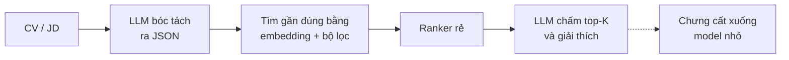

# Công nghệ và paper cho ba lõi DevRoom

Cập nhật 19/9/2026. Nguồn do ba agent tra web, mở trang hoặc đối chiếu kết quả tìm kiếm.

## Tóm tắt

Cả ba lõi hiện nay đều lai: LLM làm phần ngôn ngữ, mô hình chuyên dụng làm phần đo lường và xếp hạng. DevRoom lệch rõ nhất ở lõi 1, nơi LLM đang được dùng để đo năng lực.

| Lõi | Cách chủ đạo hiện nay | Vai trò của LLM | DevRoom so với thế giới |
| --- | --- | --- | --- |
| 1. Học thích ứng | IRT/CAT, Elo, knowledge tracing, FSRS | Sinh câu hỏi, giải thích, dạy kèm | Lệch: LLM ước lượng proficiency |
| 2. Phỏng vấn thử AI | LLM phỏng vấn, LLM chấm theo rubric | Gần như toàn bộ | Đúng hướng |
| 3. CV và so khớp JD | Phễu: embedding + lọc → ranker → LLM chấm top-K | Bóc tách, chấm top-K, giải thích | Đúng hướng, thiếu embedding ở bước lọc và kiểm thiên lệch |

Quỹ đạo chung của cả ba: quy tắc, rồi thống kê và ML cổ điển, rồi deep learning từ khoảng 2015, rồi LLM từ 2023.

## Lõi 1 — Học thích ứng

Ngành đo năng lực bằng IRT, Elo hoặc knowledge tracing; LLM chỉ sinh nội dung và dạy kèm. Năm nghiên cứu 2024–2026 cho thấy LLM tự ước lượng năng lực kém hơn mô hình chuyên dụng.

### Thế giới làm thế nào

- Duolingo Birdbrain: bản 1 là mô hình kiểu IRT mở rộng từ Elo, bản 2 là LSTM. GPT-4 trong Duolingo Max chỉ lo giải thích và đóng vai hội thoại ([IEEE Spectrum](https://spectrum.ieee.org/duolingo)).
- Duolingo English Test: GPT-3 viết nháp câu hỏi, người duyệt, chấm bằng bài thi thích ứng dựa trên IRT ([Duolingo blog](https://blog.duolingo.com/test-creation-machine-learning/)).
- Khan Academy: Khanmigo dạy kèm, còn mức mastery tính theo luật cố định ([Khan Academy](https://support.khanacademy.org/hc/en-us/articles/5548760867853)).
- Anki: FSRS có sẵn từ bản 23.10, phát hành 1/11/2023 ([changelog](https://changes.ankiweb.net/changes/23.10.html)).
- Mốc khác: GRE chuyển sang CAT tháng 11/1993, GMAT năm 1997; SM-2 ra đời tháng 12/1987; Khanmigo và Duolingo Max cùng công bố ngày 14/3/2023 trên GPT-4.

### Paper

| Năm | Paper | Tác giả, nơi đăng | Ý chính |
| --- | --- | --- | --- |
| 2026 | [Specialised KT Models Outperform LLMs](https://arxiv.org/abs/2603.02830) | Bhattacharyya et al., EDM 2026 | Mô hình KT chính xác hơn LLM, rẻ và nhanh hơn nhiều bậc |
| 2026 | [arXiv 2602.01015](https://arxiv.org/abs/2602.01015) | Borchers, Vie, Azevedo, arXiv | GPT-4.1 luôn dự đoán người học làm tốt hơn thực tế |
| 2025 | [arXiv 2512.23036](https://arxiv.org/abs/2512.23036) | Hooshyar et al., arXiv | DKT đạt AUC 0,83, thắng LLM; LLM fine-tune vẫn kém 6%, tốn khoảng 198 giờ huấn luyện, có lúc cập nhật mastery ngược chiều |
| 2025 | [BEA 2025](https://aclanthology.org/2025.bea-1.75/) | Srivatsa et al., BEA | Không cặp model–prompt nào khớp năng lực học sinh thật qua các môn và lớp |
| 2024 | [LLM cho knowledge tracing](https://arxiv.org/abs/2403.14661) | Neshaei et al., EDM 2024 | LLM fine-tune chỉ ngang BKT, dưới state of the art |
| 2024 | [Explainable Few-shot Knowledge Tracing](https://arxiv.org/abs/2405.14391) | Li et al., arXiv | Phản biện: GPT-4 few-shot ngang hoặc hơn DKT, SAKT trên vài bộ dữ liệu |
| 2024 | [A Survey of Knowledge Tracing](https://arxiv.org/abs/2105.15106) | Shen et al., IEEE TLT 17 | Survey knowledge tracing |
| 2024 | [Survey of Computerized Adaptive Testing: A Machine Learning Perspective](https://arxiv.org/abs/2404.00712) | Zhuang et al., arXiv | Survey CAT |
| 2024 | [BanditCAT / AutoIRT](https://arxiv.org/abs/2410.21033) | arXiv | Hiệu chỉnh độ khó câu hỏi do máy sinh bằng IRT |
| 2022 | [A Stochastic Shortest Path Algorithm for Optimizing Spaced Repetition Scheduling](https://doi.org/10.1145/3534678.3539081) | Ye, Su, Cao, KDD | Gốc của FSRS, huấn luyện trên 220 triệu log MaiMemo |
| 2022 | [pyKT](https://arxiv.org/abs/2206.11460) | NeurIPS 2022 | Đa số mô hình KT deep chỉ hơn DKT gốc rất ít |
| 2022 | [Sinh câu hỏi tự động cho Duolingo English Test](https://doi.org/10.3389/frai.2022.903077) | Attali et al., Frontiers in AI | Câu hỏi do máy sinh, hiệu chỉnh bằng thống kê |
| 2020 | [SAINT](https://arxiv.org/abs/2002.07033) | Choi et al., L@S | Transformer encoder–decoder cho KT |
| 2020 | [AKT](https://dl.acm.org/doi/10.1145/3394486.3403282) | Ghosh, Heffernan, Lan, KDD | Attention kết hợp Rasch |
| 2019 | [SAKT](https://arxiv.org/abs/1907.06837) | Pandey, Karypis, EDM | Self-attention cho KT |
| 2016 | [Applications of the Elo rating system in adaptive educational systems](https://doi.org/10.1016/j.compedu.2016.03.017) | Pelánek, Computers & Education 98 | Elo đơn giản, ổn định, xử lý tốt người dùng mới |
| 2016 | [A Trainable Spaced Repetition Model for Language Learning](https://aclanthology.org/P16-1174/) | Settles, Meeder, ACL | Half-Life Regression; tăng 12% tương tác hằng ngày trên Duolingo |
| 2015 | [Deep Knowledge Tracing](https://proceedings.neurips.cc/paper/2015/hash/bac9162b47c56fc8a4d2a519803d51b3-Abstract.html) | Piech et al., NeurIPS | LSTM cho knowledge tracing |
| 1995 | [Knowledge tracing: Modeling the acquisition of procedural knowledge](https://link.springer.com/article/10.1007/BF01099821) | Corbett, Anderson, UMUAI 4(4) | BKT: HMM cho xác suất đã thuộc từng skill |
| 1985 | [Spaces for the assessment of knowledge](https://www.aleks.com/about_aleks/knowledge_space_theory) | Doignon, Falmagne, IJMMS 23 | Knowledge Space Theory, quan hệ tiên quyết; nền của ALEKS |
| 1982 | [Improving Measurement Quality and Efficiency with Adaptive Testing](https://journals.sagepub.com/doi/10.1177/014662168200600408) | Weiss, Applied Psych. Measurement | Nền tảng CAT |
| 1980 | [Applications of IRT to Practical Testing Problems](https://www.routledge.com/Applications-of-Item-Response-Theory-To-Practical-Testing-Problems/Lord/p/book/9780898590067) | Lord, sách | IRT làm cơ sở cho CAT |
| 1960 | [Probabilistic Models for Some Intelligence and Attainment Tests](https://www.rasch.org/memo63.htm) | Rasch | Mô hình IRT một tham số |

### Đối chiếu DevRoom

- Tác vụ B (Sonnet 5 ước lượng proficiency từ lịch sử trả lời) ngược với cả paper lẫn thực tế ngành.
- Nên đổi vai: Elo/CAT làm phần đo, LLM sinh câu hỏi và giải thích.
- Câu do LLM sinh cần hiệu chỉnh độ khó bằng dữ liệu trả lời thật, không tin nhãn độ khó LLM tự gán.
- Ôn tập: FSRS đang thay SM-2, nên nhắc trong phần đề xuất.

## Lõi 2 — Phỏng vấn thử AI

Cách chủ đạo hiện nay là LLM phỏng vấn và LLM chấm nội dung theo rubric; phân tích khuôn mặt đã bị bỏ. DevRoom đi đúng hướng này, còn thiếu đáp án mẫu cho từng câu.

### Thế giới làm thế nào

- HireVue ngừng phân tích khuôn mặt từ 3/2020, công bố 1/2021; nay chỉ chấm nội dung câu trả lời ([SHRM](https://www.shrm.org/topics-tools/news/talent-acquisition/hirevue-discontinues-facial-analysis-screening)).
- Google Interview Warmup (6/2022): chép lời và gợi ý ý chính, không chấm điểm ([Google blog](https://blog.google/company-news/outreach-and-initiatives/grow-with-google/interview-warmup/)).
- Mercor: phỏng vấn AI khoảng 20 phút, ghi âm kèm bản chép lời, chấm theo từng tin tuyển, được làm lại 3 lần ([Mercor docs](https://talent.docs.mercor.com/support/ai-interview)).
- micro1 Zara: hỏi nối tiếp trực tiếp, bản ghi chuyển cho recruiter người xem ([micro1](https://www.micro1.ai/research/zara-an-llm-based-candidate-interview-feedback-system)).
- OpenAI Realtime API (1/10/2024): speech-to-speech qua WebSocket, tự nhận lượt nói và cho ngắt lời, thay chuỗi STT → LLM → TTS ([OpenAI](https://openai.com/index/introducing-the-realtime-api/)).

### Paper

| Năm | Paper | Tác giả, nơi đăng | Ý chính |
| --- | --- | --- | --- |
| 2026 | [Chấm phỏng vấn tuyển dụng bằng LLM](https://doi.org/10.1037/apl0001396) | Stockdale, Hickman, Liu, Journal of Applied Psychology | Tập hợp nhiều model lớn, prompt mô tả kỹ năng chi tiết, ngang hoặc hơn một người chấm; tác giả thận trọng với quyết định quan trọng |
| 2026 | [PolyInterview](https://arxiv.org/abs/2607.10310) | Wen, Cao et al., arXiv | Lập kế hoạch từ JD + CV, hỏi nối tiếp theo câu trả lời, 4 bộ chấm song song; gần DevRoom nhất |
| 2026 | [Prompt injection vào LLM chấm bài](https://arxiv.org/abs/2606.03090) | Li et al., arXiv | Bộ chấm theo rubric dễ bị thao túng, cách phòng hiện có chưa đủ |
| 2025 | [MockLLM](https://arxiv.org/abs/2405.18113) | Sun et al., KDD 2025 | LLM đóng cả người phỏng vấn lẫn ứng viên, có bộ nhớ tự rút kinh nghiệm |
| 2025 | [Zara](https://arxiv.org/abs/2507.02869) | Yazdani, Mahajan, Ansari, arXiv | GPT-4o phỏng vấn và viết feedback; case study, không có số liệu đánh giá |
| 2025 | [Rubric Is All You Need](https://arxiv.org/abs/2503.23989) | Pathak et al., ICER 2025 | Với bài code, rubric riêng từng câu tốt hơn rubric chung |
| 2025 | [Chấm câu trả lời ngắn bằng GPT-4](https://dl.acm.org/doi/10.1145/3706468.3706481) | Ferreira Mello et al., LAK 2025 | Model huấn luyện thắng ở câu đã thấy, GPT-4 few-shot thắng ở câu mới |
| 2024 | [LLM-as-an-Interviewer](https://arxiv.org/abs/2412.10424) | Kim et al., arXiv | Nhiều lượt kèm hỏi nối tiếp giảm thiên vị câu dài và lệch giữa các lần chạy; đối tượng là LLM, không phải người |
| 2024 | [Large Language Models are not Fair Evaluators](https://aclanthology.org/2024.acl-long.511/) | Wang et al., ACL 2024 | Thiên vị vị trí; sửa bằng nêu bằng chứng trước điểm, đảo thứ tự, người duyệt ca khó |
| 2024 | [Prometheus](https://arxiv.org/abs/2310.08491) | Kim et al., ICLR 2024 | Rubric kèm đáp án mẫu cho tương quan r = 0,897 với người chấm |
| 2024 | [LLMs are Inconsistent and Biased Evaluators](https://arxiv.org/abs/2405.01724) | Stureborg et al., arXiv | Thiên vị câu trôi chảy, điểm lệch, bị neo, nhạy với prompt |
| 2024 | [LLM đánh giá tính cách từ phỏng vấn video](https://ieeexplore.ieee.org/document/10463124/) | Zhang, Koutsoumpis, Oostrom et al., IEEE TAffC 15(3) | Zero-shot có độ tin cậy ngang model chuyên biệt |
| 2023 | [Judging LLM-as-a-Judge with MT-Bench](https://arxiv.org/abs/2306.05685) | Zheng et al., NeurIPS 2023 | GPT-4 đồng ý với người trên 80%; thiên vị vị trí, độ dài, tự ưu tiên |
| 2023 | [G-Eval](https://aclanthology.org/2023.emnlp-main.153/) | Liu et al., EMNLP 2023 | Sinh các bước chấm bằng chain-of-thought rồi điền form; ưu tiên văn bản do LLM viết |
| 2015 | [Automated Analysis and Prediction of Job Interview Performance](https://arxiv.org/abs/1504.03425) | Naim, Tanveer, Gildea, Hoque, IEEE TAffC 9 | 138 buổi phỏng vấn; khuôn mặt, ngôn ngữ, ngữ điệu dự đoán điểm với r ≥ 0,75 |
| 2013 | [MACH: My Automated Conversation coacH](https://dl.acm.org/doi/10.1145/2493432.2493502) | Hoque et al., UbiComp 2013 | Người phỏng vấn ảo đọc khuôn mặt và ngữ điệu; thử 1 tuần với 90 sinh viên MIT |
| 2006 | [Automated Essay Scoring with e-rater V.2](https://ejournals.bc.edu/index.php/jtla/article/view/1650) | Attali, Burstein, JTLA 4(3) | Ít đặc trưng, dễ giải thích, một model cho mọi đề |
| 1966 | [The Imminence of Grading Essays by Computer](https://cir.nii.ac.jp/crid/1573105975579759360) | Page, Phi Delta Kappan 47(5) | PEG, chấm theo đặc trưng bề mặt như độ dài, dấu câu |

### Đối chiếu DevRoom

- Đã có: rubric STAR có anchor 1/3/5, JSON schema, chấm 2 lần khi confidence thấp, kiểm `evidence` phải là chuỗi con của transcript, 6 lớp chống prompt injection kèm bộ tấn công 10 mẫu trong CI.
- Thiếu: đáp án mẫu hoặc ý chính cần có cho từng câu kỹ thuật. Rubric STAR hiện là rubric chung (Prometheus, Rubric Is All You Need).
- Schema đặt `scores` trước `evidence`. Đảo lại để model trích bằng chứng trước rồi mới cho điểm; có thinking nên ảnh hưởng nhỏ, nhưng sửa không tốn gì.
- Bộ tấn công 10 mẫu nên mở rộng theo các mẫu trong paper prompt injection 2026, vì paper này cho thấy bộ chấm theo rubric vẫn dễ bị thao túng.

## Lõi 3 — CV và so khớp JD

Kiến trúc chủ đạo là phễu: tìm bằng embedding kèm bộ lọc, xếp hạng rẻ, rồi LLM chỉ chấm top-K. DevRoom đã theo phễu này nhưng bước lọc chỉ dùng join `skill_id`, và chưa kiểm thiên lệch.

### Thế giới làm thế nào

- LinkedIn Hiring Assistant: tìm gần đúng trên hơn 1 tỷ embedding, lọc theo thuộc tính, xếp hạng L2, rồi LLM kiểm độ phù hợp và viết giải thích ([LinkedIn Engineering, 2026](https://www.linkedin.com/blog/engineering/ai/semantic-search-for-ai-agents-at-scale-retrieval-and-ranking-for-linkedins-hiring-assistant); [kiến trúc 2025](https://www.linkedin.com/blog/engineering/ai/how-we-engineered-linkedins-hiring-assistant)).
- LinkedIn JUDE: học biểu diễn việc làm bằng LLM cho gợi ý việc ([LinkedIn Engineering, 5/2025](https://www.linkedin.com/blog/engineering/ai/jude-llm-based-representation-learning-for-linkedin-job-recommendations)).
- Indeed: nén hành vi người dùng thành embedding cho tìm việc ([Indeed Engineering, 6/2026](https://engineering.indeedblog.com/blog/2026/06/distilling-long-tail-user-behavior-into-scalable-embeddings-for-job-search/)).
- CareerBuilder: tìm gần đúng bằng Faiss rồi rerank ([arXiv 2107.00221](https://arxiv.org/abs/2107.00221)).
- Amazon bỏ công cụ lọc CV vì thiên vị nam giới ([Reuters, 10/2018](https://www.reuters.com/article/us-amazon-com-jobs-automation-insight-idUSKCN1MK08G)).
- Taxonomy kỹ năng: ESCO có khoảng 13.900 kỹ năng ([ESCO](https://esco.ec.europa.eu/en/about-esco/escopedia/escopedia/skills-pillar)).

### Paper

| Năm | Paper | Tác giả, nơi đăng | Ý chính |
| --- | --- | --- | --- |
| 2026 | [ConFit v3: LLM-based Re-Ranking](https://arxiv.org/abs/2605.09760) | Xiao Yu, Zhou Yu et al., arXiv | LLM rerank top 20 CV từ bước tìm bằng embedding |
| 2026 | [Semantic Search at LinkedIn](https://arxiv.org/abs/2602.07309) | LinkedIn, arXiv | LLM làm giám khảo + tìm bằng embedding + model nhỏ chưng cất, thông lượng gấp 75 lần |
| 2026 | [Towards Position-Robust Talent Recommendation via LLMs](https://arxiv.org/abs/2604.02200) | Silin Du et al., arXiv | LLM xếp hạng cả danh sách bị thiên vị vị trí |
| 2025 | [LANTERN](https://arxiv.org/abs/2510.05490) | Zhoutong Fu et al. (LinkedIn), arXiv | Chưng cất LLM lớn xuống model nhỏ để chấm độ phù hợp và giải thích |
| 2025 | [Layout-Aware Parsing Meets Efficient LLMs](https://arxiv.org/abs/2510.09722) | arXiv | Model 0,6B fine-tune bóc CV ra JSON, chạy thật trên nền tảng HR của Alibaba |
| 2025 | [No Thoughts Just AI](https://arxiv.org/abs/2509.04404) | Wilson et al., AIES 2025 | Người làm theo AI thiên lệch tới 90% trường hợp; người duyệt thôi chưa đủ |
| 2025 | [Small Changes, Large Consequences](https://arxiv.org/abs/2501.04316) | Seshadri et al., arXiv | Bỏ tên ứng viên không xóa được thiên lệch |
| 2024 | [Gender, Race, and Intersectional Bias in Resume Screening via Language Model Retrieval](https://arxiv.org/abs/2407.20371) | Wilson, Caliskan, AIES 2024 | Embedding ưu tiên tên người da trắng trong 85,1% trường hợp |
| 2024 | [Rethinking Skill Extraction in the Job Market Domain using LLMs](https://aclanthology.org/2024.nlp4hr-1.3/) | Nguyen, Zhang, Montariol, Bosselut, NLP4HR | LLM few-shot vẫn kém NER có giám sát khi trích kỹ năng |
| 2024 | [A Challenge-based Survey of E-recruitment Recommendation Systems](https://dl.acm.org/doi/10.1145/3659942) | Mashayekhi et al., ACM Computing Surveys 56(10) | Survey theo thách thức: hai chiều, cold start, công bằng |
| 2024 | [LLM xếp hạng CV theo tên](https://www.bloomberg.com/graphics/2024-openai-gpt-hiring-racial-discrimination/) | Bloomberg | GPT-3.5 xếp CV thiên lệch theo chủng tộc |
| 2023 | [LLMs as Batteries-Included Zero-Shot ESCO Skills Matchers](https://arxiv.org/abs/2307.03539) | Clavié, Soulié, arXiv | Retriever đề xuất kỹ năng ESCO, LLM rerank (+22 điểm RP@10) |
| 2023 | [Generative Job Recommendations with LLM (GIRL)](https://arxiv.org/abs/2307.02157) | Zheng, Zhu, Xiong et al., arXiv | Fine-tune + reward model + PPO, sinh JD từ CV |
| 2023 | [A Comprehensive Survey of AI Techniques for Talent Analytics](https://arxiv.org/abs/2307.03195) | Qin et al., arXiv | Survey rộng về AI trong nhân sự |
| 2023 | [RankGPT](https://aclanthology.org/2023.emnlp-main.923/) | Sun et al., EMNLP 2023 | LLM rerank top-K sau bước tìm đầu |
| 2022 | [Modeling Two-Way Selection Preference for Person-Job Fit](https://arxiv.org/abs/2208.08612) | Yang, Zhao et al., RecSys 2022 | So khớp hai chiều áp vào việc làm |
| 2019 | [Fairness-Aware Ranking in Search & Recommendation Systems](https://dl.acm.org/doi/10.1145/3292500.3330691) | Geyik et al. (LinkedIn), KDD 2019 | Rerank có ràng buộc công bằng |
| 2018 | [APJFNN](https://arxiv.org/abs/1812.08947) | Qin, Zhu, Xu et al., SIGIR 2018 | RNN + attention cân từng yêu cầu JD với từng kinh nghiệm trong CV |
| 2018 | [PJFNN](https://dl.acm.org/doi/10.1145/3234465) | Zhu, Zhu, Xiong et al., ACM TMIS 9(3) | CNN học biểu diễn chung CV–JD từ lịch sử ứng tuyển |
| 2016 | [GLMix](https://dl.acm.org/doi/10.1145/2939672.2939684) | Zhang, Chen, Agarwal et al., KDD 2016 | Hệ số chung + riêng từng người/việc; tăng 20–40% lượt ứng tuyển trên LinkedIn |
| 2010 | [RECON](https://dl.acm.org/doi/10.1145/1864708.1864747) | Pizzato et al., RecSys 2010 | Gợi ý hai chiều, tính cả sở thích hai bên |
| 2005 | [Resume Information Extraction with Cascaded Hybrid Model](https://aclanthology.org/P05-1062/) | Yu, Guan, Zhou, ACL 2005 | Chia CV thành khối rồi trích trường, dùng HMM/SVM |

### Đối chiếu DevRoom

- Đã có: lọc trước rồi LLM chấm top 30, mỗi lời gọi chấm 1 cặp nên tránh thiên vị vị trí, danh sách gửi Recruiter đã ẩn danh.
- Bước lọc: phương án chính chỉ join `skill_id`, cứng hơn cách ngành làm. Công thức `0,7·skill_match + 0,3·cosine` ở §7.3 đúng với phễu của ngành, nên đưa vào phương án chính.
- Chuẩn hóa kỹ năng ba tầng ở §7.1 (exact → alias → cosine) giống cách Clavié & Soulié làm: tìm ứng viên rồi LLM phán xét.
- Thiên lệch: ẩn danh chưa đủ (Seshadri 2025), và embedding cũng thiên lệch (Wilson & Caliskan 2024). Nên thêm kiểm thử đổi tên/giới tính vào bộ kiểm chứng.

## Pháp lý

Nếu điểm của DevRoom đến tay nhà tuyển dụng, hệ thống nhiều khả năng thuộc nhóm rủi ro cao theo luật EU. Luyện tập thuần túy có thể nằm ngoài diện này, nhưng chưa tìm được nguồn nào bàn trực tiếp.

- NYC Local Law 144, hiệu lực 5/7/2023: công cụ tự động hỗ trợ quyết định tuyển dụng phải kiểm toán thiên lệch hằng năm, công bố tóm tắt, báo ứng viên trước 10 ngày làm việc ([NYC Rules](https://rules.cityofnewyork.us/rule/automated-employment-decision-tools-updated/)). Theo tóm tắt của DLA Piper, kiểm toán của NY State Comptroller tháng 12/2025 đánh giá việc thực thi là kém hiệu quả.
- EU AI Act, Annex III: mục 4(a) tuyển dụng và đánh giá ứng viên là rủi ro cao; mục 3(b) đánh giá kết quả học tập trong cơ sở giáo dục cũng vậy ([Annex III](https://artificialintelligenceact.eu/annex/3/)). Omnibus Regulation (EU) 2026/1744 lùi hạn áp dụng Annex III đến 2/12/2027.
- Với DevRoom: chiều Recruiter của lõi 3 và điểm phỏng vấn gửi nhà tuyển dụng là hai chỗ dễ thuộc diện nhất.

## Kết luận và đề xuất

Giữ LLM làm lõi cho lõi 2 và lõi 3. Lõi 1 nên đổi vai: thuật toán đo năng lực, LLM sinh nội dung.

1. Lõi 1: Elo/CAT thay Tác vụ B để đo proficiency; LLM sinh câu hỏi, giải thích, gợi ý; nhắc FSRS như bản thay SM-2.
2. Lõi 2: thêm đáp án mẫu cho từng câu kỹ thuật; đảo `evidence` lên trước `scores` trong schema; mở rộng bộ tấn công prompt injection.
3. Lõi 3: đưa công thức §7.3 (skill_id + cosine bge-m3) vào bước lọc chính; thêm kiểm thử đổi tên và giới tính.
4. Báo cáo: thêm một đoạn pháp lý ngắn cho chiều Recruiter.

Mức độ xác minh: link do ba agent mở trực tiếp hoặc đối chiếu kết quả tìm kiếm ngày 19/9/2026. Chỉ đối chiếu qua kết quả tìm kiếm: Bloomberg 2024, Reuters 2018, OpenAI Realtime API, Stockdale 2026 (qua PubMed), đánh giá của NY State Comptroller. Phần lớn paper năm 2026 là preprint arXiv, chưa qua bình duyệt; khi trích trong báo cáo cần ghi rõ.
