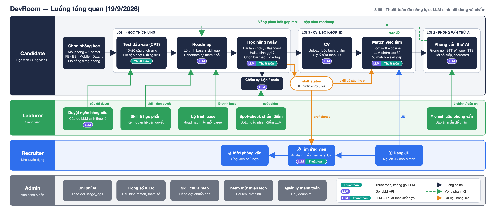

# DevRoom — Báo cáo thiết kế 19/9/2026

## 1. Quyết định hôm nay

Chốt phương án lai, thay cho "LLM API làm mọi bước". Thuật toán giữ phần đo và xếp hạng, nơi cần sai số kiểm chứng được. LLM giữ phần ngôn ngữ: sinh nội dung, chấm câu tự luận, dẫn phỏng vấn, bóc tách CV/JD. MVP làm 1 career (Frontend) với 6 skill.

| Lõi | Thuật toán làm gì | LLM làm gì |
|---|---|---|
| 1. Học thích ứng | Elo đo `θ` từng skill; `p = clamp((θ−1000)/800, 0, 1)·100`, gap khi `p < 60`. CAT chọn câu có `abs(d − θ)` nhỏ nhất. `d` khởi đầu `900 + 180·difficulty`, tự chỉnh sau ≥ 30 lượt. Lịch ôn cố định 1, 3, 7, 14, 30 ngày | Sonnet 5 sinh ngân hàng câu theo lô (Lecturer duyệt), chấm câu short/code, dựng roadmap. Haiku 4.5 ra bài hằng ngày, gợi ý 3 mức, flashcard |
| 2. Phỏng vấn thử AI | Chọn câu chính từ ngân hàng đã duyệt. Chạy code trong Piston. Chấm lần 2 khi `confidence < 0,6`. Đẩy ca khó vào hàng spot-check. Tính điểm tổng | Sonnet 5 dẫn từng lượt, hỏi nối tiếp, chấm STAR (anchor 1/3/5) đối chiếu ý chính. JSON có `evidence` trước điểm. Haiku 4.5 tổng hợp cuối buổi. Whisper (STT), edge-tts (TTS) |
| 3. CV và so khớp JD | Chuẩn hóa skill về `skill_id`. Lọc sơ `0,7·skill_match + 0,3·cosine` (bge-m3, pgvector). Khử trùng JD bằng hash + cosine. Ẩn danh danh sách Recruiter. Kiểm thử đổi tên/giới tính | Sonnet 5 bóc CV, Haiku 4.5 bóc JD ra JSON. LLM-as-judge chấm top 30, mỗi lời gọi 1 cặp, trả `% match` + gap |

Stack: Next.js · FastAPI · PostgreSQL + pgvector · Redis · Celery · Piston · Claude Sonnet 5 và Haiku 4.5 · bge-m3 · Whisper · edge-tts · Playwright crawler.

## 2. Luồng tổng quan

Bốn làn ngang là bốn vai trò: Candidate, Lecturer, Recruiter, Admin. Làn Candidate đi qua lõi 1 (phòng học → test đầu vào → roadmap → học hằng ngày), rồi lõi 3 (CV → so khớp JD) và lõi 2 (phỏng vấn thử). Mũi tên ngược là vòng phản hồi: gap từ lõi 2 và 3 thành đề xuất, Candidate nhận thì roadmap đổi. Lecturer cấp nội dung cho lõi 1 và 2; Recruiter cấp JD, nhận ứng viên ẩn danh; Admin giữ taxonomy, tham số, chi phí.

## 3. Tính năng theo vai trò

Cột "Cách làm": **TT** = thuật toán tất định, **LLM** = gọi Claude, **CRUD** = nhập/sửa dữ liệu thường.

### 3.1 Candidate

| Tính năng | Lõi | Cách làm | MVP |
|---|---|---|---|
| Tạo nhiều phòng học, mỗi phòng 1 career | 1 | CRUD | Có |
| Test đầu vào 15–20 câu thích ứng | 1 | TT: CAT chọn câu, Elo cập nhật `θ`. LLM: Sonnet 5 chấm short/code | Có |
| Hồ sơ năng lực theo skill (0–100) | 1 | TT: `p` từ `θ`, gap khi `p < 60` | Có |
| Roadmap gợi ý, tự thêm/bỏ học phần | 1 | LLM: Sonnet 5 từ lộ trình base + gap. CRUD: thêm/bỏ. Code cảnh báo thiếu prerequisite | Có |
| Bài tập hằng ngày, gợi ý 3 mức khi sai | 1 | LLM: Haiku 4.5 chọn bài, chấm, gợi ý. TT: Elo cập nhật `θ` | Có |
| Flashcard + lịch ôn | 1 | LLM: Haiku 4.5 sinh thẻ. TT: lịch 1, 3, 7, 14, 30 ngày | Có |
| Code sandbox (đề, test case, chạy code) | 1 | TT: Piston chạy test case | Có |
| CV: upload, AI tạo hoặc tự làm; chấm + gợi ý sửa theo JD | 3 | LLM: Sonnet 5 bóc tách và chấm. CRUD: builder, xuất PDF | Có |
| Feed JD 3 nguồn, `% match`, skill gap, lưu JD mục tiêu | 3 | TT: lọc sơ. LLM: Sonnet 5 chấm cặp, trả gap | Có |
| Mock interview giọng nói, hỏi nối tiếp | 2 | LLM: Sonnet 5 dẫn và chấm. Whisper, edge-tts. TT: Piston cho câu code | Có |
| Scorecard STAR, transcript, nghe lại | 2 | TT: điểm tổng. LLM: Haiku 4.5 tổng hợp skill yếu | Có |
| Nhận/bỏ qua đề xuất cải thiện lộ trình | 1 ← 2, 3 | TT: sinh đề xuất từ gap, chống trùng. CRUD: nhận/bỏ | Có |
| Ứng tuyển của tôi (kanban theo stage) | 3 | CRUD | Có |
| Trợ lý AI riêng (hỏi đáp, nhắc ôn, bước tiếp theo) | — | LLM: Claude tool use đọc `θ`, roadmap, CV, kết quả | Có |
| Ghi nhận phỏng vấn thật, đối chiếu mock | 2 | LLM: map câu bị hỏi về `skill_id` | Sau |

### 3.2 Lecturer

| Tính năng | Lõi | Cách làm | MVP |
|---|---|---|---|
| Học phần theo career: gắn skill, nội dung, prerequisite | 1 | CRUD | Có |
| Lộ trình base cho từng career | 1 | CRUD | Có |
| Duyệt ngân hàng câu test do Sonnet 5 sinh theo lô | 1 | LLM sinh, CRUD duyệt (`review_status`) | Có |
| Bài tập 4 thể loại, gắn tag + độ khó | 1 | CRUD. LLM gợi ý tag | Có |
| Ngân hàng câu phỏng vấn kèm ý chính | 2 | LLM: Sonnet 5 sinh nháp. CRUD duyệt | Có |
| Spot-check chấm phỏng vấn (confidence thấp, từ chối, injection) | 2 | CRUD trên hàng đợi `spot_checks` | Có |
| Theo dõi chất lượng đề: tỷ lệ đúng, `d` lệch nhãn | 1 | TT: thống kê `answers`, `elo_d` sau hiệu chỉnh | Sau |

### 3.3 Recruiter

| Tính năng | Lõi | Cách làm | MVP |
|---|---|---|---|
| Đăng JD, xác nhận skill do AI bóc | 3 | LLM: Haiku 4.5 bóc JD. CRUD sửa/đóng tin | Có |
| Tìm ứng viên: danh sách ẩn danh, xếp theo match + Elo + mock | 3 | TT: lọc sơ, ẩn danh. LLM: Haiku 4.5 chấm top 30, 1 cặp mỗi lời gọi | Có |
| Pipeline phỏng vấn: mời, đổi trạng thái, ghi chú | 3 | CRUD | Có |
| Gói đăng tin / mở hồ sơ | — | CRUD. MVP: Admin xác nhận tay | Sau |

### 3.4 Admin

| Tính năng | Lõi | Cách làm | MVP |
|---|---|---|---|
| Người dùng, RBAC 4 role, quota token | — | CRUD | Có |
| Taxonomy skill, alias, hàng đợi skill chưa map | 3 | CRUD | Có |
| Crawl JD TopCV/ITviec, duyệt JD crawl/agent | 3 | Playwright + LLM (Haiku 4.5 bóc). CRUD duyệt | Có |
| Khử trùng JD | 3 | TT: hash, rồi cosine + trigram tiêu đề | Có |
| Tham số thuật toán (`K` Elo, `0,7/0,3`, ngưỡng 60) | 1, 3 | CRUD trên `settings` | Có |
| Kiểm thử thiên lệch đổi tên/giới tính | 3 | TT: chạy lại so khớp trên CV biến thể, so chênh lệch | Có |
| Logging, chi phí token, phút STT/TTS | — | TT: tổng hợp `usage_logs` | Có |
| Doanh thu, giao dịch, đối soát | — | CRUD trên `transactions` | Có |

## 4. CSDL theo vai trò

PostgreSQL 16 + pgvector. Tên bảng/cột theo §4.5 [báo cáo kỹ thuật](../BAO-CAO-KY-THUAT-CORE.md). **(mới)** = chưa có ở §4.5. **(đổi)** = có ở §4.5 nhưng đổi cột hoặc đổi nghĩa. Mọi bảng có `created_at`, `updated_at`, không liệt kê.

### 4.1 Chung

| Bảng | Cột chính | Ai ghi |
|---|---|---|
| `roles` | `id`, `code` (candidate/lecturer/recruiter/admin), `permissions` | Seed |
| `users` | `id` uuid, `email`, `full_name`, `role_id`→roles, `status`, `daily_token_cap` | Người dùng đăng ký; Admin đổi role, quota |
| `careers` | `id`, `code` (fe/be/mobile/devops/data/qa), `name_vi` | Admin (seed) |
| `skills` | `id`, `code`, `name_en`, `name_vi`, `parent_id`, `embedding` vector(1024) | Admin; bge-m3 sinh `embedding` |
| `skill_aliases` | `id`, `skill_id`→skills, `alias` (UNIQUE `lower`), `source` (admin/llm/lecturer) | Admin; LLM đề xuất |
| `career_skills` | `career_id`, `skill_id`, `weight` 1–3, `is_core` | Admin |
| `agent_threads` / `agent_messages` | `id`, `user_id` / `thread_id`, `role`, `content` | Trợ lý AI |

### 4.2 Candidate — lõi 1 (học thích ứng)

| Bảng | Cột chính | Ai ghi |
|---|---|---|
| `rooms` | `id` uuid, `user_id`, `career_id`, `name`, `tested_at` | Candidate |
| `skill_states` (đổi) | `room_id`, `skill_id` (UNIQUE cặp), `theta` (mặc định 1200), `proficiency` (cột sinh từ `theta`), `answered_count`, `correct_count`, `last_source` | Chỉ Elo ghi; LLM không ghi |
| `answers` (đổi) | `id`, `room_id`, `question_id`, `session_kind`, `answer_text` (mới), `is_correct`, `score` 0–1 (mới), `graded_by` rule/llm (mới), `elapsed_ms`, `theta_before`, `theta_after`, `k_used` | Candidate trả lời; Sonnet 5 chấm short/code; Elo |
| `roadmap_items` | `id`, `room_id`, `module_id`, `position`, `status`, `source`, `suggestion_id`, `reason`, `removed_at` | Sonnet 5 đề xuất; Candidate sửa |
| `exercise_attempts` | `id`, `room_id`, `exercise_id`, `skill_id`, `assigned_for`, `is_correct`, `score`, `hint_level` 0–3, `theta_before`, `theta_after` | Haiku 4.5 chọn, chấm; Elo |
| `review_states` (đổi) | `room_id`, `flashcard_id`, `step` 0–4 (mới, chỉ số vào lịch 1/3/7/14/30), `due_on`, `lapses`; bỏ `ef`, `interval_days` | Lịch ôn cố định |
| `code_submissions` | `id`, `room_id`, `problem_id`, `language`, `source_code`, `passed`, `total`, `status` | Candidate; Piston |
| `suggestions` | `id`, `room_id`, `skill_id`, `module_id`, `origin` (jd_match/mock_interview/assessment/agent), `origin_ref`, `reason`, `status` | Lõi 2, 3 tạo; Candidate nhận/bỏ |

### 4.3 Candidate — lõi 2 (phỏng vấn thử)

| Bảng | Cột chính | Ai ghi |
|---|---|---|
| `interview_sessions` (đổi) | `id` uuid, `user_id`, `room_id`, `jd_id`, `difficulty` easy/medium/hard, `mode`, `status`, `total_score`, `star_avg`, `weak_skill_ids`, `low_confidence` (mới) | Candidate mở; server tính điểm |
| `interview_turns` (đổi) | `id`, `session_id`, `turn_idx`, `question_id`→interview_questions (mới, NULL khi hỏi nối tiếp), `is_follow_up`, `skill_id`, `question_text`, `answer_text`, `audio_key`, `code_result` (mới, kết quả Piston) | Sonnet 5 hỏi; Whisper chép lời |
| `interview_scores` (mới) | `turn_id`, `run_no` 1/2, `evidence`, `key_points_hit`, `missing_points`, `s`, `t`, `a`, `r` (1–5), `confidence`, `model` | Sonnet 5; lần 2 khi `confidence < 0,6` |

### 4.4 Candidate — lõi 3 (CV và so khớp)

| Bảng | Cột chính | Ai ghi |
|---|---|---|
| `cvs` | `id` uuid, `user_id`, `origin`, `storage_key`, `parse_status`, `extracted` jsonb, `skill_ids`, `embedding`, `score` | Candidate; Sonnet 5 bóc; bge-m3 |
| `cv_versions` | `cv_id`, `version`, `content`, `score`, `score_detail`, `target_jd_id` | Sonnet 5 chấm, gợi ý sửa |
| `match_scores` (đổi) | `jd_id`, `user_id`, `cv_id`, `skill_match` (mới), `cosine` (mới), `prefilter_score` (mới), `match_pct`, `verdict` (mới), `gaps` (mới), `method` formula/llm, `refreshed_at` | TT lọc sơ; LLM-as-judge top 30 |
| `applications` | `id`, `user_id`, `jd_id`, `cv_id`, `stage`, `match_pct`, `initiated_by` | Candidate hoặc Recruiter |

### 4.5 Lecturer (nội dung)

| Bảng | Cột chính | Ai ghi |
|---|---|---|
| `modules` | `id`, `code`, `career_id`, `name`, `hours`, `skill_ids`, `content`, `status` | Lecturer |
| `module_prerequisites` | `module_id`, `requires_id` | Lecturer |
| `base_roadmaps` | `id`, `career_id`, `version`, `is_current`, `module_ids` (thứ tự) | Lecturer |
| `questions` (đổi) | `id`, `skill_id`, `kind` mcq/short/code, `stem`, `answer_key` (mới), `explanation`, `difficulty` 1–5, `elo_d`, `times_served`, `times_correct`, `source` llm_batch/lecturer/github, `content_hash`, `review_status` draft/approved/rejected (đổi, thay `needs_review`), `reviewed_by` (mới) | Sonnet 5 sinh lô; Lecturer duyệt; Elo chỉnh `elo_d` khi `times_served ≥ 30` |
| `question_options` | `question_id`, `idx`, `content`, `is_correct` | Sonnet 5; Lecturer sửa |
| `exercises` | `id`, `name`, `kind`, `skill_ids`, `tags`, `difficulty`, `elo_d`, `payload` (question_id hoặc code_problem_id), `module_id` | Lecturer |
| `flashcards` | `id`, `skill_id`, `front`, `back`, `module_id`, `created_by` | Haiku 4.5 sinh; Lecturer duyệt |
| `code_problems` | `id`, `slug`, `skill_id`, `statement`, `difficulty`, `elo_d`, `starter_code`, `entry_fn`, `tests` | Lecturer |
| `interview_questions` (mới) | `id`, `career_id`, `skill_id`, `difficulty` easy/medium/hard, `kind` technical/behavioral/code, `body`, `key_points` text[], `code_problem_id`, `source` bank/llm, `review_status` | Sonnet 5 sinh nháp; Lecturer duyệt |
| `spot_checks` (mới) | `id`, `turn_id`, `reason` low_confidence/refusal/injection/random, `status`, `reviewer_id`, `lecturer_scores`, `note` | Server xếp hàng; Lecturer chấm |

### 4.6 Recruiter

| Bảng | Cột chính | Ai ghi |
|---|---|---|
| `jd_postings` (đổi) | `id`, `source` crawl/agent/recruiter, `source_url`, `recruiter_id`, `title`, `company`, `career_id`, `level`, `description`, `embedding`, `content_hash`, `duplicate_of`, `dup_method` hash/cosine (mới), `status`, `reviewed_by` | Recruiter (③), crawler (①), agent (②); Admin duyệt |
| `jd_skills` | `jd_id`, `skill_id`, `raw_name`, `is_required`, `weight` 1–3, `years_min`, `map_method` | Haiku 4.5 bóc; chuẩn hóa alias |
| `application_events` | `application_id`, `from_stage`, `to_stage`, `actor_id`, `note` | Recruiter |
| `transactions` | `id`, `recruiter_id`, `kind`, `amount_vnd`, `status`, `confirmed_by` | Recruiter mua; Admin xác nhận |

### 4.7 Admin (vận hành)

| Bảng | Cột chính | Ai ghi |
|---|---|---|
| `settings` | `key`, `value` jsonb, `updated_by` | Admin |
| `usage_logs` | `id`, `user_id`, `feature`, `provider`, `model`, `tokens_in`, `tokens_out`, `audio_seconds`, `tts_chars`, `cost_usd`, `status` | Mọi lời gọi LLM, STT, TTS |
| `audit_logs` | `id`, `actor_id`, `action`, `entity`, `entity_id`, `before`, `after` | Server (append-only) |
| `bias_audits` (mới) | `id`, `run_id`, `cv_id`, `jd_id`, `variant` name_swap/gender_swap, `stage` prefilter/judge, `pct_original`, `pct_variant`, `delta`, `passed` | Bộ kiểm chứng (Celery); Admin xem |

Quan hệ chính: `skill_id` là trục chung. `skill_states`, `questions`, `exercises`, `flashcards`, `code_problems`, `interview_questions`, `interview_turns`, `jd_skills`, `cvs.skill_ids`, `suggestions` đều trỏ về `skills.id`. `room_id` gom trạng thái học của một phòng. `suggestions` nối lõi 2, 3 về `roadmap_items`.

## 5. Dữ liệu cần thiết

| Dữ liệu | Số lượng cho MVP (Frontend) | Nguồn | Ai cung cấp | File mẫu |
|---|---|---|---|---|
| Career, skill, `career_skills` | 1 career; 6 skill MVP: javascript, react, css, http, testing, git; thêm TypeScript, HTML và 2 nhóm cha cho JD mẫu | Tự soạn, khớp demo lõi 1 | Admin | `data/skills.json` |
| Alias skill | ≈ 5–10 alias mỗi skill (JS, ReactJS, REST…) | Tự soạn; LLM đề xuất thêm | Admin | `data/skill_aliases.csv` |
| Học phần, prerequisite, lộ trình base | 6 học phần, 1 lộ trình base | Seed §4.2.3 báo cáo kỹ thuật | Lecturer | `data/modules.json` |
| Ngân hàng câu test (`questions`) | 240 câu = 6 skill × 5 mức × 8; file mẫu giữ 30 câu (6 skill × 5 mức × 1) | Sonnet 5 sinh theo lô (≈ $1,4); tham khảo `lydiahallie/javascript-questions` | Lecturer duyệt | `data/questions.json` |
| Bài tập hằng ngày | Dùng lại ngân hàng câu qua `exercises.payload` | Như trên | Lecturer | — |
| Bài code (`code_problems`) | ≈ 10 bài | Lecturer viết; tham khảo Blind 75, NeetCode | Lecturer | — |
| Flashcard | Sinh lúc chạy từ bài làm sai | Haiku 4.5 | Hệ thống | — |
| Câu phỏng vấn + ý chính | ≈ 50 câu (bằng golden set lõi 2) | Sonnet 5 sinh nháp; `tech-interview-handbook` | Lecturer duyệt | `data/interview_questions.json` |
| JD | 200 JD (golden set G2) | Crawl TopCV/ITviec, Recruiter đăng, Kaggle LinkedIn Job Postings | Admin (crawler), Recruiter | `data/jd_samples.json` |
| CV | 100 CV (golden set G1), thêm bản đổi tên/giới tính | Kaggle Resume Dataset, CV tự tạo | Nhóm đồ án | `data/cv_samples.json` |
| Nhãn chấm phỏng vấn | 150 transcript (50 câu × 3 mức), 2 Lecturer chấm | Ghi thử nội bộ | Lecturer | — |
| Cặp CV × JD gán nhãn | 300 cặp (golden set G4) | Từ JD, CV mẫu | Nhóm đồ án | — |
| Tham số Elo, lịch ôn, so khớp, phỏng vấn | 1 bộ | Mục 5 README ba lõi | Admin | `data/settings.json` |
| Log làm bài kiểm Elo (tùy chọn) | Không import vào DB | Mô phỏng; ASSISTments | Nhóm đồ án | — |

## 6. Tham chiếu

- [DANH-GIA-LOI-1.md](DANH-GIA-LOI-1.md): vì sao lõi 1 đổi vai sang Elo/CAT.
- [NGHIEN-CUU-3-LOI.md](NGHIEN-CUU-3-LOI.md): paper và cách ngành làm cho ba lõi.
- [BAO-CAO-KY-THUAT-CORE.md](../BAO-CAO-KY-THUAT-CORE.md): §4.2 seed, §4.5 lược đồ CSDL, §6.1 bảng màn hình.
