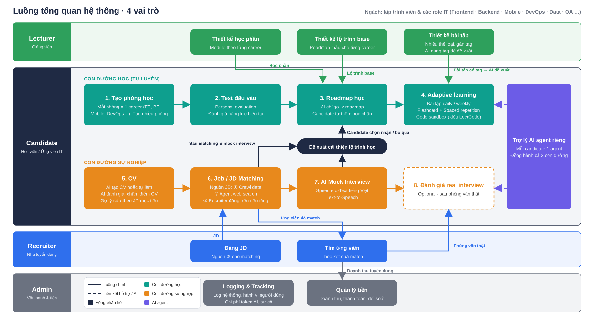

# DevRoom — Báo cáo đề tài

Nền tảng học thích ứng, luyện phỏng vấn và kết nối việc làm cho lập trình viên.

Sinh viên thực hiện: …………………… · Giảng viên hướng dẫn: ……………………

## 1. Giới thiệu

Sinh viên ngành công nghệ thông tin thường học dàn trải, không xác định được kỹ năng còn thiếu so với yêu cầu tuyển dụng, thiếu môi trường luyện phỏng vấn có phản hồi, và viết CV không khớp mô tả công việc. Về phía nhà tuyển dụng, việc sàng lọc dựa trên CV dạng văn bản không phản ánh năng lực thật.

Đề tài xây dựng DevRoom, nền tảng dành riêng cho các vị trí IT, nhằm gộp ba hoạt động học, luyện phỏng vấn và tìm việc thành một chu trình khép kín có phản hồi.

## 2. Giải pháp

Người học chọn career, làm bài test đầu vào để xác định kỹ năng thiếu, học theo lộ trình được gợi ý, luyện phỏng vấn thử với AI, rồi xây dựng CV và so khớp với việc làm. Kết quả phỏng vấn thử và kỹ năng thiếu so với JD tự động quay lại thành đề xuất học bù; năng lực đã kiểm chứng trở thành thông tin cho nhà tuyển dụng thay cho tự khai.

Hệ thống có bốn vai trò: Candidate học và tìm việc; Lecturer thiết kế học phần, bài tập và lộ trình mẫu; Recruiter đăng JD và xem ứng viên xếp theo năng lực thực; Admin theo dõi nhật ký, chi phí AI và tài chính. Toàn bộ dùng chung một từ điển kỹ năng (ESCO) để ba phân hệ so khớp được với nhau.

## 3. Ba lõi xử lý

### 3.1 Học thích ứng

Lõi này đo năng lực từng kỹ năng, gợi ý lộ trình và giao bài đúng độ khó. Mô hình ngôn ngữ sinh câu hỏi theo kỹ năng và độ khó, chấm, và dựa vào kết quả các câu trước để điều chỉnh câu sau; sau 15–20 câu trả về điểm năng lực 0–100 và danh sách kỹ năng thiếu. Roadmap được gợi ý từ catalog học phần của Lecturer, người học tự thêm bớt; bài tập hằng ngày chọn theo kỹ năng thiếu, có chấm và gợi ý; code chạy trong sandbox cô lập. Đề xuất bổ sung: thuật toán Elo kết hợp test thích ứng để đo năng lực không tốn token, đồ thị tiên quyết để xếp lộ trình, SM-2 cho lịch ôn.

### 3.2 Phỏng vấn thử với AI

Người học trả lời bằng giọng nói theo JD hoặc career đã chọn. Giọng nói được chuyển thành văn bản; mô hình đóng vai người phỏng vấn, chấm theo khung STAR với rubric có mô tả mức điểm, quyết định hỏi thêm khi câu trả lời chưa đủ sâu, và trả về kết quả dạng JSON kèm bằng chứng trích từ câu trả lời. Cuối buổi, mô hình tổng hợp kỹ năng yếu và chọn học phần từ catalog để đẩy về roadmap; người học nhận hoặc bỏ qua. Đề xuất bổ sung: chấm theo quy tắc làm phương án dự phòng và kiểm tra chéo.

### 3.3 CV và so khớp JD

Mô hình đọc CV và JD, bóc tách kỹ năng gắn mã trong từ điển chung, số năm kinh nghiệm và vai trò; kỹ năng ngoài từ điển đưa vào hàng đợi cho Admin duyệt. CV được chấm theo rubric và nhận gợi ý sửa theo JD mục tiêu. JD thu từ ba nguồn: thu thập tự động, agent tìm trên web và Recruiter đăng. So khớp thực hiện bằng cách đưa hồ sơ CV và JD cho mô hình trả tỉ lệ khớp, kỹ năng thiếu và lý do; chiều Recruiter lọc sơ bằng giao kỹ năng trước khi gọi mô hình. Đề xuất bổ sung: công thức so khớp có trọng số kết hợp độ tương đồng vector để xếp hạng nhiều ứng viên bằng một truy vấn.

## 4. Công nghệ

Phương án chính là LLM API, dùng Claude Sonnet 5 cho tác vụ chính và Claude Haiku 4.5 cho tác vụ nhẹ, đầu ra ép theo JSON schema, không huấn luyện mô hình; chi phí ước tính 0,3–0,6 USD mỗi người dùng hoạt động mỗi tháng. Các thuật toán tất định nêu ở phần đề xuất bổ sung đã được thiết kế và cài đặt trong bản demo, dùng khi cần giảm chi phí, tăng tính nhất quán hoặc giải thích kết quả. Thành phần còn lại gồm Next.js, FastAPI, PostgreSQL với pgvector, Redis, sandbox Piston, Whisper và TTS qua API.

## 5. Kết luận

DevRoom nối học, luyện phỏng vấn và tìm việc thành một chu trình có phản hồi, trong đó năng lực được đo và kiểm chứng thay vì tự khai. Đề tài đã hoàn thành sơ đồ nghiệp vụ, thiết kế ba lõi theo phương án LLM API kèm thuật toán đề xuất, và bản demo chạy trong trình duyệt tại `anhnt-24.github.io/sieuduan_md`.
