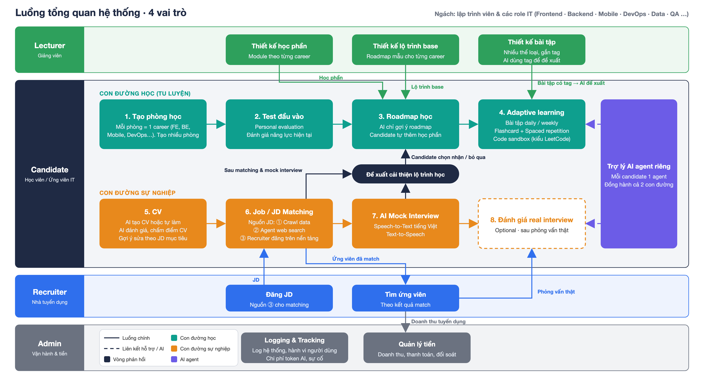

# Siêu đồ án – Báo cáo tổng hợp

> Viết lại theo luồng đã chốt (sơ đồ `LUONG-TONG-QUAN.png`). Bỏ cách chia "Hướng A / Hướng B" và vai trò Mentor của bản cũ: giờ chỉ có **1 hệ thống, 4 vai trò**, ngách hẹp là lập trình viên & role IT. Mục 4, 6, 8, 9 là phần **đề xuất** về công nghệ, thuật toán, phạm vi và rủi ro cho quy mô đồ án.

---

## 1. Tổng quan

- **Ngách**: chỉ lập trình viên & các role IT: Frontend · Backend · Mobile · DevOps · Data · QA. Không phải nền tảng học chung.
- **Giá trị 1 câu**: ứng viên IT *đo năng lực → học đúng lỗ hổng → làm CV & match JD → luyện phỏng vấn → kết quả phản hồi ngược về lộ trình học*, trong 1 hệ thống.
- **4 vai trò**:

| Vai trò | Là ai | Việc chính |
|---|---|---|
| **Candidate** | Học viên / ứng viên IT | Học theo phòng (1 phòng = 1 career) · CV · JD matching · mock interview |
| **Lecturer** | Giảng viên | Thiết kế học phần · bài tập có tag · lộ trình base cho từng career |
| **Recruiter** | Nhà tuyển dụng | Đăng JD · tìm ứng viên đã match · mời phỏng vấn thật |
| **Admin** | Vận hành & tiền | Logging & Tracking · Quản lý tiền |

---

## 2. Luồng nghiệp vụ

### 2.1 Candidate – Con đường học (tu luyện)

| Bước | Nội dung |
|---|---|
| **1. Tạo phòng học** | Mỗi phòng = 1 career (FE / BE / Mobile / DevOps / Data / QA). Tạo được nhiều phòng, mỗi phòng có Elo và roadmap riêng |
| **2. Test đầu vào** | Personal evaluation: đo năng lực hiện tại theo từng skill của career đó. 15–20 câu, chọn câu thích ứng theo năng lực |
| **3. Roadmap học** | AI **chỉ gợi ý** roadmap (từ lộ trình base của Lecturer + skill gap). Candidate tự thêm / bỏ học phần, AI không ép |
| **4. Adaptive learning** | Bài tập daily / weekly chọn theo dải Elo + tag · Flashcard + spaced repetition · Code sandbox kiểu LeetCode (đề + test case + chạy code) |

### 2.2 Candidate – Con đường sự nghiệp

| Bước | Nội dung |
|---|---|
| **5. CV** | AI tạo CV từ hồ sơ năng lực, hoặc candidate tự làm / upload. AI đánh giá, chấm điểm, gợi ý sửa theo JD mục tiêu |
| **6. Job / JD Matching** | JD từ 3 nguồn: ① crawl (TopCV, ITviec…) · ② agent web search · ③ Recruiter đăng trên nền tảng. Ra % match + skill-gap cho từng JD |
| **7. AI Mock Interview** | Phỏng vấn bằng giọng nói: Speech-to-Text tiếng Việt + Text-to-Speech. Follow-up tự động, scorecard STAR / Big O |
| **8. Đánh giá real interview** | **Optional.** Sau phỏng vấn thật với Recruiter: candidate nhập lại câu hỏi gặp phải + kết quả, AI đối chiếu với mock để tìm điểm yếu còn sót |

### 2.3 Vòng phản hồi (khớp nối 2 con đường)

1. Sau JD matching (6) và mock interview (7) → hệ thống sinh **"Đề xuất cải thiện lộ trình học"** (skill nào thiếu, học phần nào nên thêm).
2. Candidate **chọn nhận hoặc bỏ qua** từng đề xuất.
3. Nhận → cập nhật Roadmap (3) → Adaptive learning (4) đổi theo.

Đây là điểm khác biệt của hệ thống, phải demo được end-to-end.

### 2.4 Trợ lý AI agent riêng

- Mỗi candidate 1 agent, đồng hành cả 2 con đường: hỏi đáp, nhắc lịch ôn, gợi ý bước tiếp theo ("hôm nay nên làm gì").
- Agent đọc được ngữ cảnh của candidate (Elo, roadmap, CV, kết quả match / mock) qua tool, không chỉ chat chay.

### 2.5 Liên lane

| Từ | Đến | Dữ liệu chảy |
|---|---|---|
| Lecturer | Roadmap (3) | Học phần · Lộ trình base |
| Lecturer | Adaptive learning (4) | Bài tập có tag → AI dùng tag để đề xuất |
| Recruiter | JD Matching (6) | Đăng JD = nguồn ③ |
| JD Matching (6) | Recruiter | "Ứng viên đã match" → màn Tìm ứng viên |
| Recruiter | Đánh giá real interview (8) | Phỏng vấn thật |
| Recruiter | Admin | Doanh thu tuyển dụng |

---

## 3. Tính năng theo vai trò

### 3.1 Candidate

| Nhóm | Tính năng |
|---|---|
| **Phòng học** | Tạo nhiều phòng, mỗi phòng 1 career · Test đầu vào thích ứng · Hồ sơ năng lực theo skill (Elo → 0–100) |
| **Roadmap** | AI gợi ý từ lộ trình base + gap · Tự thêm / bỏ học phần · Nhận / bỏ qua đề xuất cải thiện |
| **Adaptive learning** | Bài tập daily / weekly theo Elo + tag · Flashcard + spaced repetition · Code sandbox (đề, test case, chạy code) · AI gợi ý khi sai |
| **CV** | AI tạo hoặc tự làm · Upload PDF/DOCX · Chấm điểm + gợi ý sửa theo JD mục tiêu · Xuất PDF |
| **JD Matching** | Feed JD từ 3 nguồn · % match · Skill-gap từng JD · Lưu JD mục tiêu |
| **Mock interview** | Phòng PV theo JD hoặc skill · Voice tiếng Việt (STT + TTS) · Follow-up · Scorecard STAR / Big O · Transcript + nghe lại |
| **Real interview** | (Optional) Ghi nhận kết quả PV thật, đối chiếu với mock |
| **AI agent** | Chat hỏi đáp · Nhắc lịch ôn · Gợi ý bước tiếp theo |

### 3.2 Lecturer

| Nhóm | Tính năng |
|---|---|
| **Học phần** | Tạo / sửa module theo career · Bài giảng text / video / quiz |
| **Bài tập** | Nhiều thể loại: trắc nghiệm, tự luận ngắn, flashcard, coding (đề + test case) · **Gắn tag** (skill, career, thể loại, độ khó) để AI đề xuất |
| **Lộ trình base** | Roadmap mẫu cho từng career: thứ tự học phần + prerequisite |
| **Theo dõi** | Tỷ lệ đúng / bỏ dở theo bài tập, để sửa đề hoặc chỉnh độ khó |

### 3.3 Recruiter

| Nhóm | Tính năng |
|---|---|
| **JD** | Đăng JD · AI bóc tách skill / yêu cầu · Sửa / đóng tin |
| **Ứng viên** | Danh sách ứng viên đã match, xếp theo % match + Elo + điểm mock · Xem hồ sơ năng lực + CV |
| **Phỏng vấn** | Mời phỏng vấn thật · Ghi trạng thái (mời → PV → offer / từ chối) |
| **Thanh toán** | Gói đăng tin / mở khóa hồ sơ (nguồn doanh thu hiện tại của hệ thống) |

### 3.4 Admin

| Nhóm | Tính năng |
|---|---|
| **Logging & Tracking** | Log hệ thống · Hành vi người dùng · Chi phí token AI, phút STT/TTS · Sự cố (sandbox, crawler, API) |
| **Quản lý tiền** | Doanh thu (hiện chỉ từ Recruiter) · Thanh toán · Đối soát |
| **Vận hành** | RBAC 4 role · Taxonomy skill / tag · Trọng số thuật toán · Duyệt JD crawl về |

---

## 4. Công nghệ: đề xuất → khả thi

> **Phương án triển khai đã chọn: LLM API.** Mọi thành phần cần hiểu, sinh hoặc đánh giá nội dung (đánh giá năng lực, sinh roadmap, bài tập và gợi ý, bóc tách CV và JD, so khớp, phỏng vấn thử, trợ lý) gọi mô hình ngôn ngữ lớn qua API với đầu ra ép JSON schema; không huấn luyện mô hình. Sandbox, STT/TTS, crawler và CSDL giữ nguyên như bảng dưới. Các thuật toán tất định ở mục 6 là **đề xuất bổ sung**: thay thế hoặc kiểm tra chéo từng bước LLM khi cần giảm chi phí, tăng nhất quán hoặc giải thích kết quả. Chi tiết cách LLM API đảm nhiệm từng lõi nằm trong `core/01`, `core/02`, `core/03` (mục 3 của mỗi tài liệu) và `BAO-CAO-DE-TAI-DEVROOM.md` mục 4.

**Tiêu chí khả thi**: setup < 1 ngày · chạy được trên laptop/VPS nhỏ · không cần dữ liệu train sẵn · có free tier hoặc mã nguồn mở · tài liệu đủ nhiều.

### 4.1 Học thích ứng

| Nhu cầu | Gốc | Đề xuất khả thi | Lý do |
|---|---|---|---|
| Đo năng lực & độ khó | pyBKT / py-IRT | **Elo rating theo skill, tách theo phòng học** (tự viết ~50 dòng) | BKT/IRT cần lịch sử làm bài lớn để fit tham số. Elo chạy từ 0 dữ liệu |
| Lộ trình base + prerequisite | NetworkX / Neo4j | **PostgreSQL**: bảng `modules` + `module_prerequisites`, duyệt bằng recursive CTE. Vẽ bằng **React Flow** | Đồ thị < 1.000 node thì Postgres đủ, không thêm DB |
| Hệ tag bài tập | (chưa nêu) | Bảng `tags` (skill, career, thể loại, độ khó) + `exercise_tags`. Lecturer gắn tay, LLM gợi ý tag lúc tạo bài | Tag là đầu vào để AI đề xuất bài, phải có từ đầu |
| Đề xuất bài daily / weekly | (chưa nêu) | Tag ∩ skill-gap, lọc theo dải Elo ±100 (xem 6.3) | Không cần ML |
| Spaced Repetition | (chưa nêu) | **SM-2** (thuật toán Anki) hoặc `py-fsrs` | Công thức 20 dòng |
| Code sandbox | Judge0 / Docker SDK / Firecracker | **Piston** (1 lệnh Docker, 50+ ngôn ngữ) hoặc **Judge0 CE**. Bỏ Firecracker | Firecracker cần KVM bare-metal. Piston/Judge0 có sẵn giới hạn CPU/RAM/tắt network |
| Editor | Monaco / CodeMirror | **Monaco** (`@monaco-editor/react`) | Giữ nguyên |
| AI gợi ý khi sai | (chưa nêu) | LLM nhận đề + code + lỗi → gợi ý theo cấp độ (hint 1 → hint 2 → lời giải) | Prompt đơn giản, Haiku 4.5 đủ |

### 4.2 CV & JD Matching

| Nhu cầu | Gốc | Đề xuất khả thi | Lý do |
|---|---|---|---|
| Parse PDF/DOCX | pdfminer.six / PyMuPDF / Tesseract | **PyMuPDF** + **python-docx**. Bỏ Tesseract. Hoặc gửi thẳng PDF cho Claude (document input) | Tesseract chỉ cần khi CV là ảnh scan, hiếm |
| Trích xuất kỹ năng | SpaCy / GLiNER | **LLM structured output**: Claude + JSON schema `{skills[], years, roles[], education}`, map về ID taxonomy | SpaCy phải train. LLM làm 1 bước cả trích xuất lẫn chuẩn hóa |
| AI tạo CV | (chưa nêu) | LLM sinh JSON CV từ hồ sơ năng lực (skill đạt, bài code pass, project) → template → `@react-pdf/renderer` | Ép vào schema, không cho LLM sinh layout tự do |
| Chấm điểm CV | (chưa nêu) | **Rule + LLM**: rule (đủ mục, độ dài, keyword khớp JD, ATS-friendly) + LLM chấm nội dung theo rubric, trả JSON | Rule cho điểm ổn định, LLM cho phần định tính |
| Crawler JD (nguồn ①) | (chưa nêu) | **Playwright** (trang render JS) hoặc **Crawlee** (Python/Node, có queue, retry, chống trùng sẵn). Chạy theo lịch, chỉ danh mục IT | Crawlee gói sẵn phần vặt (retry, proxy, dedupe) |
| Agent web search JD (nguồn ②) | (chưa nêu) | **Tavily** (API search cho LLM agent, có free tier) · **Brave Search API** · **SerpAPI**. Agent gọi search → fetch trang → LLM bóc JD | Tavily trả nội dung sạch sẵn, ít phải parse |
| Embedding | text-embedding-3-small / bge-m3 | **bge-m3** (local, tốt tiếng Việt) hoặc **OpenAI text-embedding-3-small** | Chọn theo có / không GPU |
| Vector DB | pgvector / Milvus / Qdrant | **Chỉ pgvector** + index HNSW | < 10.000 record, pgvector thừa sức |
| Re-ranking | LightGBM / CatBoost | **Công thức trọng số tuyến tính**, Admin chỉnh `w` trên UI | LightGBM cần nhãn "ai được tuyển", không có |
| CV builder | (chưa nêu) | **dnd-kit** + `@react-pdf/renderer` xuất PDF | – |
| Skills Taxonomy | ESCO / O*NET | Import ESCO vào bảng `skills`, chỉ lấy nhánh ICT. Dịch tên sang tiếng Việt bằng LLM 1 lần | Chỉ cần nhánh IT, nhỏ hơn nhiều |

### 4.3 AI Mock Interview

| Nhu cầu | Gốc | Đề xuất khả thi | Lý do |
|---|---|---|---|
| Voice | WebRTC / LiveKit / Agora + VAD | **MVP: turn-based (push-to-talk)**: `MediaRecorder` ghi → upload → STT → LLM → TTS → phát. Sau MVP: OpenAI Realtime API / Gemini Live | WebRTC + VAD streaming là phần khó nhất. Turn-based đủ để chấm STAR, làm trong 1 tuần |
| STT tiếng Việt | Whisper API / Faster-Whisper | **Whisper large-v3 qua Groq** (free tier, nhanh) hoặc OpenAI. Self-host: **PhoWhisper** (VinAI, Whisper fine-tune cho tiếng Việt) nếu có GPU | Whisper large-v3 nhận tiếng Việt ổn. PhoWhisper tốt hơn với giọng vùng miền nhưng cần GPU |
| TTS tiếng Việt | ElevenLabs / OpenAI TTS / Coqui / Edge-TTS | **edge-tts** giọng `vi-VN-HoaiMyNeural` (nữ) / `vi-VN-NamMinhNeural` (nam), miễn phí. Cần ổn định: **Google Cloud TTS** (vi-VN Neural2, free 1M ký tự/tháng) | ElevenLabs đắt. Coqui ngừng phát triển |
| LLM interviewer + chấm rubric | (tên model cũ) | **Claude Sonnet 5** (`claude-sonnet-5`, $2/$10 per 1M token) làm interviewer + chấm STAR / Big O bằng structured output JSON. **Haiku 4.5** ($1/$5) follow-up ngắn, gán nhãn. **Opus 5** ($5/$25) chỉ khi chấm khó | Sonnet 5 đủ mạnh, rẻ hơn Opus 2,5× |
| VAD | Silero VAD | Chỉ cần khi streaming: `@ricky0123/vad-web` | Turn-based thì bỏ |
| Chấm phát âm | (chưa nêu) | **Bỏ ở MVP** | Bài toán nghiên cứu riêng, không phải trọng tâm |
| Camera / share màn hình | WebRTC | **Bỏ**. Phỏng vấn thật với Recruiter → gửi link Google Meet | AI không cần nhìn camera |
| Live coding trong PV | Docker sandbox | Dùng chung Piston + Monaco ở 4.1 | – |
| Stream text về UI | SSE | **WebSocket** (FastAPI có sẵn) | 1 kênh dùng chung cho chat, trạng thái phòng |

### 4.4 Trợ lý AI agent riêng

| Nhu cầu | Đề xuất khả thi | Lý do |
|---|---|---|
| Vòng lặp agent | **Claude tool use** qua **tool runner của Anthropic SDK** (`client.beta.messages.tool_runner`, Python `@beta_tool`) | SDK tự chạy vòng gọi tool → trả kết quả → gọi tiếp, không phải tự viết loop |
| Tool cho agent | `get_profile`, `get_roadmap`, `get_due_flashcards`, `get_recent_scores`, `search_jd`, `suggest_next_step` – đều là hàm gọi DB nội bộ | Agent chỉ đọc + đề xuất, không tự sửa roadmap (candidate quyết) |
| Trí nhớ | Bảng `agent_messages` + tóm tắt hội thoại mỗi 20 lượt bằng LLM | Không cần vector memory ở MVP |
| Model | Haiku 4.5 cho chat thường · Sonnet 5 khi cần lập kế hoạch | Tối ưu chi phí |

### 4.5 Backend & hạ tầng chung

| Nhu cầu | Gốc | Đề xuất khả thi | Lý do |
|---|---|---|---|
| Backend | NestJS / Go + FastAPI | **1 backend FastAPI (Python)**. Bỏ Go, bỏ NestJS | Mọi thư viện AI (PyMuPDF, bge-m3, crawler, Whisper) đều Python. 2 backend = 2 lần auth, deploy, log |
| Frontend | (chưa nêu) | **Next.js + TypeScript + Tailwind + shadcn/ui**. Dashboard: Recharts | – |
| Database | PostgreSQL | **PostgreSQL + pgvector**. Gợi ý **Supabase** (Postgres + pgvector + Auth + Storage, free tier) | Gộp 4 thành phần thành 1 dịch vụ |
| Auth / RBAC | (chưa nêu) | Supabase Auth hoặc JWT tự viết, 4 role | – |
| Cache / Queue | Redis · BullMQ / Celery | Redis · **Celery + Redis** cho crawler theo lịch, gán tag hàng loạt | Crawler cần lịch chạy + retry, BackgroundTasks không đủ |
| Storage | MinIO / S3 | Supabase Storage hoặc **Cloudflare R2** (10 GB free) | – |
| Logging & Tracking | (chưa nêu) | Bảng `usage_log` (token, giây audio, model, chi phí ước tính) · `events` (hành vi user) · `error_log`. Dashboard bằng SQL aggregate | Đủ cho Admin, không cần ELK |
| Quản lý tiền | Payment (NestJS) | **MVP**: bảng `orders`, `payments`, Admin xác nhận chuyển khoản tay · **Sau**: VNPay sandbox / Stripe test mode | Doanh thu chỉ từ Recruiter, luồng đơn giản |
| Deploy | (chưa nêu) | Docker Compose trên 1 VPS. Hoặc Vercel (FE) + Railway/Render (BE) | – |

---

## 5. Stack chốt

| Lớp | Chọn |
|---|---|
| Phương án lõi | LLM API (Claude Sonnet 5 chính, Haiku 4.5 việc nhẹ và hàng loạt; thay được bằng GPT/Gemini), đầu ra ép JSON schema |
| Frontend | Next.js · TypeScript · Tailwind · shadcn/ui |
| UI đặc thù | Monaco (editor) · React Flow (roadmap) · dnd-kit (CV builder) · Recharts |
| Backend | FastAPI (Python 3.12) · WebSocket native |
| Database | PostgreSQL + pgvector (Supabase hoặc Docker) |
| Cache / Queue | Redis · Celery (crawler, gán tag) |
| Storage | Supabase Storage / Cloudflare R2 |
| LLM | Claude Sonnet 5 ($2/$10) chính · Haiku 4.5 ($1/$5) việc rẻ · Opus 5 ($5/$25) khi cần |
| AI agent | Claude tool use, tool runner của Anthropic SDK |
| Embedding | bge-m3 (local) hoặc text-embedding-3-small |
| STT / TTS tiếng Việt | Whisper large-v3 (Groq/OpenAI), PhoWhisper nếu self-host · edge-tts vi-VN / Google Cloud TTS |
| Crawler / Web search | Playwright hoặc Crawlee · Tavily / Brave Search API / SerpAPI |
| Code sandbox | Piston (Docker) |
| Adaptive engine | Elo per skill per phòng + SM-2 (tự viết) · hệ tag bài tập |
| Thanh toán | Bảng orders/payments + xác nhận tay → VNPay sandbox |
| Deploy | Docker Compose / Vercel + Railway |

---

## 6. Thuật toán đề xuất bổ sung cho tính năng Core

Các thuật toán dưới đây là phương án bổ sung cho từng bước LLM API đã chọn ở mục 4: dùng làm fallback khi mô hình lỗi, kiểm tra chéo kết quả mô hình, hoặc thay thế ở bước cần chi phí thấp và kết quả nhất quán. Toàn bộ đã được cài đặt trong demo tĩnh.

**Chú giải mức độ**: 🟢 Xanh – dễ, công thức/rule rõ, 1–3 ngày · 🟡 Vàng – trung bình, cần tinh chỉnh hoặc dữ liệu · 🔴 Đỏ – khó, kết quả không chắc, phải có phương án dự phòng.

### 6.1 Test đầu vào & Elo theo phòng học

| Tính năng | Thuật toán / cách xử lý | Mức | Ghi chú |
|---|---|---|---|
| Elo theo phòng học | Mỗi `(candidate, phòng, skill)` có `θ` (khởi tạo 1200); mỗi câu hỏi có `d`. Phòng khác nhau → `θ` riêng | 🟢 | 1 skill (vd SQL) ở phòng BE và Data đo riêng, vì yêu cầu khác nhau |
| Công thức Elo | `E = 1 / (1 + 10^((d − θ)/400))` · `θ' = θ + K(S − E)` · `d' = d − K(S − E)`, S = 1 đúng / 0 sai | 🟢 | ~20 dòng code |
| Độ khó ban đầu câu hỏi | Lecturer gắn tag độ khó 1–5, hoặc LLM gán → map Elo 1000 / 1200 / 1400 / 1600 / 1800. Tự hiệu chỉnh khi có người làm | 🟡 | Cold start, lệch ban đầu chấp nhận được |
| Test đầu vào thích ứng (CAT) | Chọn câu chưa làm có `d` gần `θ` nhất, xoay vòng qua các skill của career. K giảm dần 64 → 32 → 16. Dừng khi 15–20 câu hoặc `|Δθ|` < 20 trong 3 câu liên tiếp | 🟢 | |
| Proficiency 0–100 | `p = clamp((θ − 1000) / 800, 0, 1) × 100`; "đạt" khi p ≥ 60 | 🟢 | Ngưỡng Admin chỉnh |

### 6.2 Roadmap gợi ý

| Tính năng | Thuật toán / cách xử lý | Mức | Ghi chú |
|---|---|---|---|
| Skill-gap của career | `gap = skill của career (từ lộ trình base) − skill đã đạt (p ≥ 60)`; xếp theo `weight × (1 − p/100)` | 🟢 | |
| AI gợi ý roadmap | Lộ trình base là DAG (`module_prerequisites`). Roadmap gợi ý = topological sort các học phần chưa đạt ∩ gap, ưu tiên học phần mở được nhiều học phần con | 🟢 | Đồ thị nhỏ, < 50 ms |
| Candidate chỉnh roadmap | Bảng `roadmap_items` với `source = ai_suggested / user_added`, cờ `removed`. Thêm / bỏ tự do; chỉ cảnh báo (không chặn) khi thiếu prerequisite | 🟢 | AI chỉ gợi ý, không ép |

### 6.3 Adaptive learning

| Tính năng | Thuật toán / cách xử lý | Mức | Ghi chú |
|---|---|---|---|
| Đề xuất bài tập daily / weekly | Ứng viên = bài có `tag ∩ skill-gap ≠ ∅` và `d ∈ [θ − 100, θ + 100]` của skill đó. Daily: 5 bài; weekly: 1 bộ 15 bài + 1 bài code. Ưu tiên skill gap lớn, bài chưa làm | 🟢 | 3 đúng liên tiếp → dải +100; 2 sai liên tiếp → dải −100 |
| Spaced Repetition (SM-2) | `I₁ = 1`, `I₂ = 6`, `Iₙ = Iₙ₋₁ × EF`. `EF' = EF + 0.1 − (5 − q)(0.08 + (5 − q)·0.02)`, EF ≥ 1.3. q < 3 → reset về I₁ | 🟢 | q = 0–5 từ đúng/sai + thời gian trả lời |
| Chấm code sandbox | Piston chạy code với từng test case; so `stdout.trim()`; giới hạn 5 s / 256 MB; điểm = số test pass | 🟢 | Ẩn 50% test case |
| AI gợi ý khi sai | 3 mức: nhắc khái niệm → chỉ dòng/ý sai → lời giải. Mức 1–2 cấm lộ đáp án | 🟢 | Haiku 4.5 đủ dùng |
| Cập nhật Elo sau bài tập | Mỗi bài làm = 1 "ván" Elo với K = 16 | 🟢 | Dùng chung engine 6.1 |

### 6.4 CV

| Tính năng | Thuật toán / cách xử lý | Mức | Ghi chú |
|---|---|---|---|
| Parse CV PDF/DOCX | PyMuPDF / python-docx lấy text theo block. Text rỗng (CV dạng ảnh) → gửi thẳng PDF cho Claude | 🟢 | CV 2 cột: sort block theo tọa độ |
| Trích xuất kỹ năng | LLM structured output JSON `{skills:[{name, years, level}], roles[], education[]}` | 🟢 | Temperature 0, schema strict |
| Chuẩn hóa về taxonomy | 3 tầng: exact match alias ESCO → embedding cosine ≥ 0.85 → hàng đợi "unmapped" cho Admin thêm alias | 🟡 | Phụ thuộc bảng alias, bồi đắp dần |
| AI tạo CV | Từ hồ sơ năng lực (skill đạt, bài code pass, project) + vài câu hỏi → LLM sinh JSON theo schema CV → render template | 🟢 | Không cho LLM sinh layout |
| Chấm điểm CV (rule + LLM) | Rule 50%: đủ mục, 1–2 trang, có số liệu, keyword khớp JD. LLM 50%: rubric rõ ràng / tác động / phù hợp JD, mỗi mục 0–5 kèm evidence | 🟡 | LLM chấm 2 lần lấy trung bình |
| Gợi ý sửa theo JD mục tiêu | Diff `skill JD − skill CV` → LLM viết gợi ý từng mục (thêm gì, bỏ gì, viết lại câu nào) | 🟢 | |

### 6.5 JD Matching

| Tính năng | Thuật toán / cách xử lý | Mức | Ghi chú |
|---|---|---|---|
| Crawler (nguồn ①) | Playwright / Crawlee chạy theo lịch (Celery beat), chỉ danh mục IT. Dedupe theo `hash(title + company)` | 🟡 | Site đổi HTML → vỡ selector. Giới hạn 100–200 tin/lần |
| Agent web search (nguồn ②) | Tool `search_jobs(query)` gọi Tavily / Brave → lọc URL job → fetch → LLM bóc thành JD chuẩn. Query sinh từ career + skill của candidate | 🟡 | Chất lượng phụ thuộc search API. Giới hạn 10 query/ngày/candidate |
| Recruiter đăng (nguồn ③) | Form + LLM bóc skill / yêu cầu, Recruiter xác nhận trước khi đăng | 🟢 | |
| Bóc tách JD | Cùng pipeline 6.4, thêm `required / nice_to_have` + `weight` 1–3 | 🟢 | |
| % Match CV–JD | `skill_match = Σ wᵢ·cᵢ / Σ wᵢ`, `cᵢ` = 1 (có) / 0.5 (cùng nhánh cha ESCO hoặc cosine ≥ 0.8) / 0. `match = 0.7·skill_match + 0.3·cosine(emb_CV, emb_JD)` | 🟢 | 0.7 / 0.3 Admin chỉnh |
| Skill-gap theo JD | `gap = required(JD) − covered(CV ∪ skill đạt)`; xếp theo `weight × (1 − p)` | 🟢 | Đầu vào của vòng phản hồi (6.7) |
| Feed JD | `score = w1·match + w2·recency + w3·nguồn (③ > ① > ②)`; loại tin đã lưu / ẩn; top 50 | 🟢 | |

### 6.6 AI Mock Interview (turn-based)

| Tính năng | Thuật toán / cách xử lý | Mức | Ghi chú |
|---|---|---|---|
| Sinh câu hỏi theo JD / skill | Top-k câu từ ngân hàng theo `skill_id` (RAG nhẹ) → LLM chọn + biến thể theo JD, gắn `skill_id` + `difficulty` | 🟢 | Gắn `skill_id` để vòng phản hồi chạy được |
| Pipeline voice tiếng Việt 1 lượt | `MediaRecorder` (WebM/Opus) → Whisper large-v3 → LLM → edge-tts vi-VN → phát. TTS theo từng câu | 🟡 | 3–6 s/lượt, chấp nhận ở MVP. Tên công nghệ tiếng Anh lẫn tiếng Việt: thêm prompt từ vựng cho STT |
| Chấm + Follow-up trong 1 call | LLM trả JSON `{scores:{S,T,A,R}, missing_points[], decision, follow_up_question}`. Tối đa 2 follow-up / câu | 🟢 | Ít call = rẻ + nhanh |
| Scorecard STAR | Mỗi thành phần 0–5 kèm `evidence` từ transcript; rubric có anchor điểm 1 / 3 / 5 | 🔴 | LLM chấm không ổn định: chấm 2 lần lấy trung bình; Lecturer spot-check 10% phiên |
| Big O cho câu coding | Kết quả test (Piston) + thời gian chạy + LLM đọc code kết luận | 🟡 | Hiển thị "ước lượng" |
| Đánh giá real interview (optional) | Candidate nhập câu hỏi gặp + tự chấm 1–5 → LLM map về `skill_id`, so với điểm mock cùng skill | 🟢 | Cùng đổ vào vòng phản hồi |
| Chống lạc đề / prompt injection | System prompt cố định, câu trả lời bọc tag riêng, output ép JSON schema | 🟡 | |

### 6.7 Vòng phản hồi

| Tính năng | Thuật toán / cách xử lý | Mức | Ghi chú |
|---|---|---|---|
| Đề xuất từ JD matching | Với mỗi skill trong gap của JD mục tiêu (6.5): tìm học phần có tag skill đó chưa nằm trong roadmap → đề xuất `{skill, học phần, lý do: "JD X yêu cầu"}` | 🟢 | |
| Đề xuất từ mock interview | Câu `score < 3/5` → cập nhật Elo skill với `S = score/5` → skill tụt dưới ngưỡng → đề xuất học phần / bộ bài tập theo tag | 🟢 | |
| Gom & xếp hạng đề xuất | Gộp theo skill, điểm = `weight_JD × (1 − p) + số câu yếu`; tối đa 5 đề xuất / lần | 🟢 | Tránh spam |
| Candidate nhận / bỏ qua | Bảng `roadmap_suggestions` với `status = pending / accepted / dismissed`. Nhận → thêm vào `roadmap_items` (`source = ai_suggested`) | 🟢 | Bỏ qua → không đề xuất lại trong 14 ngày |

### 6.8 Trợ lý AI agent riêng

| Tính năng | Thuật toán / cách xử lý | Mức | Ghi chú |
|---|---|---|---|
| Vòng lặp agent | Tool runner SDK: LLM gọi tool → server chạy hàm → trả kết quả → LLM tiếp, đến khi có câu trả lời | 🟢 | Có sẵn trong SDK |
| Gợi ý "hôm nay làm gì" | Rule trước (flashcard đến hạn > bài daily chưa làm > đề xuất pending > mock chưa làm), LLM diễn đạt | 🟢 | Rule quyết, LLM chỉ viết câu |
| Giới hạn | 50 lượt / ngày; tool chỉ đọc. Hành động (thêm học phần) trả về link để candidate tự bấm | 🟢 | Chi phí + an toàn |

### 6.9 Recruiter

| Tính năng | Thuật toán / cách xử lý | Mức | Ghi chú |
|---|---|---|---|
| Ứng viên đã match theo JD | Công thức 6.5 chiều ngược: 1 JD × N candidate. `score = match + w·mock_score cùng career`. Tie-break: hoạt động gần nhất | 🟢 | Precompute khi JD tạo, refresh mỗi đêm |
| Hồ sơ năng lực | Mỗi skill: `p` 0–100, số bài pass, điểm mock. Nhãn "Verified" khi p ≥ 60 **và** có mock ≥ 3/5 | 🟢 | |
| Trạng thái phỏng vấn | enum `invited → interviewed → offer / rejected`; đổi trạng thái → thông báo candidate, mở bước 8 | 🟢 | |

### 6.10 Admin

| Tính năng | Thuật toán / cách xử lý | Mức | Ghi chú |
|---|---|---|---|
| RBAC 4 role | `roles`, `permissions`, `role_permissions`; middleware kiểm tra theo route | 🟢 | |
| Logging & Tracking | `usage_log` (token, giây audio, model, chi phí ước tính) · `events` (login, làm bài, mock, apply) · `error_log`. Materialized view refresh mỗi giờ; alert khi vượt ngân sách ngày | 🟢 | |
| Quản lý tiền | `orders` (gói Recruiter) → `payments` → Admin đối soát; báo cáo doanh thu theo tháng | 🟢 | Cổng thanh toán thật sau MVP |
| Taxonomy & tag | Import ESCO nhánh ICT; hàng đợi "unmapped" + alias; duyệt tag Lecturer tạo mới | 🟡 | Việc thủ công lặp lại, UI phải gọn |
| Trọng số thuật toán | Bảng `settings` key/value (`0.7/0.3`, dải Elo, ngưỡng đạt); cache Redis; đổi có hiệu lực ngay | 🟢 | |

---

## 7. Nguồn dữ liệu

| Nhóm | Dataset | Dùng để |
|---|---|---|
| CV & JD | Kaggle *LinkedIn Job Postings* | JD thực tế: title, description, skills |
| | Kaggle *Resume Dataset* / *Tech Resumes* | Test parser + matching |
| | **ESCO** (nhánh ICT) · **O*NET** (Mỹ) | Skills Taxonomy |
| | Crawl TopCV / ITviec (Playwright / Crawlee) | Nguồn ① của JD Matching, JD sát thị trường VN |
| Adaptive | **ASSISTments** · **EdNet** (Riiid) | Lịch sử làm bài để test Elo |
| | GitHub: `lydiahallie/javascript-questions`, `awesome-interview-questions` | Ngân hàng quiz đã chia chủ đề, gắn tag |
| Mock Interview | Blind 75 · NeetCode 150 | Đề coding + test case + độ khó |
| | `donnemartin/system-design-primer` · `yangshun/tech-interview-handbook` | Rubric + câu hỏi cho system prompt |

**Chiến thuật nhanh**
1. Tải 1 dataset Job + 1 dataset Resume từ Kaggle.
2. Lấy quiz từ GitHub theo chủ đề.
3. Script Python gọi **Claude Haiku 4.5 qua Batch API** (giảm 50% giá) gán `tag` (skill, career, thể loại), `difficulty (1–5)` → JSON → import PostgreSQL. Lecturer chỉ cần duyệt, không phải tạo từ đầu.

---

## 8. Phạm vi MVP + thứ tự làm

**Ý kiến**: đồ án ăn điểm ở chỗ 2 con đường nối với nhau bằng vòng phản hồi. Làm đủ 8 bước ở mức "chạy được end-to-end" quan trọng hơn làm sâu 1 bước.

| Mức | Tính năng |
|---|---|
| **Core (bắt buộc)** | Phòng học + test đầu vào Elo · Roadmap gợi ý + candidate chỉnh · Bài daily theo tag + flashcard SM-2 + sandbox · CV upload / AI tạo + chấm + gợi ý sửa · JD nguồn ③ + ① + ② (② ở mức tối giản) + % match + skill-gap · Mock interview turn-based tiếng Việt + scorecard · Vòng phản hồi nhận / bỏ qua · AI agent chat với 4–5 tool · Lecturer: học phần, bài tập có tag, lộ trình base · Recruiter: đăng JD, danh sách match, mời PV · Admin: RBAC, logging, đơn hàng xác nhận tay |
| **Sau MVP** | Đánh giá real interview · Voice realtime · Cổng thanh toán thật (VNPay sandbox) · Live coding trong PV · Email thông báo · Bài weekly · Leaderboard · Chứng chỉ |
| **Cắt hẳn** | Mentor / lịch 1:1 · Bán khóa học · Camera / share màn hình · Chấm phát âm · Firecracker · Neo4j · Milvus/Qdrant · LightGBM · Go / NestJS · Xác thực pháp lý DN tự động (cờ "verified" Admin bật tay) |

**Thứ tự làm**
1. Nền: Auth 4 role · schema Postgres · import ESCO nhánh ICT + bảng tag · Next.js skeleton.
2. Lecturer: học phần · bài tập có tag · lộ trình base (cần có nội dung trước khi làm Candidate).
3. Con đường học: phòng học → test Elo → roadmap gợi ý → bài daily / flashcard / sandbox.
4. Con đường sự nghiệp: CV → JD (③ trước, rồi ①, ②) → % match → mock interview turn-based.
5. Vòng phản hồi + AI agent riêng.
6. Recruiter + Admin (logging, tiền) → gắn thành 1 luồng demo.

---

## 9. Rủi ro & câu hỏi mở

### 9.1 Rủi ro chính

| Rủi ro | Cách xử lý |
|---|---|
| LLM chấm STAR / CV không ổn định | Rubric có anchor · chấm 2 lần lấy trung bình · Lecturer spot-check 10% |
| Voice tiếng Việt: STT sai tên công nghệ, TTS đọc thuật ngữ tiếng Anh ngọng | Prompt từ vựng cho Whisper · phiên âm / giữ nguyên tiếng Anh trong câu TTS · turn-based trước, realtime sau |
| Chi phí API (LLM, STT, TTS) | Log `usage_log` · giới hạn phiên/ngày · Haiku 4.5 cho việc rẻ · Batch API cho gán nhãn |
| Crawler vỡ khi site đổi HTML | Selector tập trung 1 file · alert khi số tin crawl = 0 · nguồn ③ luôn có để demo |
| Agent web search trả JD rác | Whitelist domain · LLM chấm "có phải JD IT không" trước khi lưu |
| Ít nội dung Lecturer lúc đầu | Seed từ GitHub quiz + LLM gán tag, Lecturer chỉ duyệt |
| Không có dữ liệu train (BKT, LightGBM) | Dùng thuật toán không cần train: Elo, SM-2, công thức trọng số |
| Bảo mật sandbox | Piston/Judge0 mặc định tắt network, giới hạn CPU/RAM/thời gian |
| Tiếng Việt trong matching | Embedding bge-m3 · ESCO chỉ tiếng Anh, dịch 1 lần bằng LLM |

### 9.2 Câu hỏi mở (chưa chốt)

| Câu hỏi | Hiện trạng | Cần quyết |
|---|---|---|
| **Mô hình tiền cho Lecturer** | Doanh thu hiện chỉ từ Recruiter. Lecturer có thu tiền / chia doanh thu hay không: **chưa chốt** | Miễn phí (đồ án) · thù lao theo bài tập được dùng · chia % doanh thu Recruiter |
| **Pháp lý crawl JD** | TopCV / ITviec có điều khoản hạn chế crawl; robots.txt chưa rà | Rà ToS + robots.txt · chỉ lưu link + tóm tắt, không sao chép nguyên văn · hoặc chỉ dùng nội bộ đồ án |
| **Chi phí STT/TTS tiếng Việt khi scale** | Groq free tier có hạn mức; edge-tts miễn phí nhưng không SLA | Đo phút/phiên thực tế · ngưỡng chuyển sang OpenAI / Google Cloud TTS trả phí |
| Dữ liệu cho "Đánh giá real interview" | Chưa rõ candidate tự nhập hay Recruiter nhận xét | Chốt khi làm sau MVP |

---

## Phụ lục – Giải thích nhanh các công nghệ

| Tên | Là gì |
|---|---|
| **BKT / IRT** | Mô hình xác suất đoán học viên đã "nắm" kỹ năng chưa (BKT) và đo độ khó câu hỏi vs năng lực ẩn (IRT). Cần dữ liệu lớn |
| **Elo rating** | Thuật toán xếp hạng cờ vua. Học viên thắng câu hỏi khó → ability tăng, câu hỏi bị thắng nhiều → difficulty giảm |
| **SM-2 / FSRS** | Thuật toán lên lịch ôn tập ngắt quãng của Anki |
| **CAT** | Computerized Adaptive Testing: chọn câu tiếp theo dựa trên năng lực ước lượng hiện tại |
| **Judge0 / Piston** | Dịch vụ nhận code + input, chạy trong container cô lập, trả stdout/stderr |
| **Firecracker** | MicroVM của AWS Lambda. Cần KVM, quá nặng cho đồ án |
| **WebRTC / LiveKit / Agora** | Truyền audio/video 2 chiều độ trễ thấp. LiveKit mã nguồn mở, Agora trả phí |
| **VAD** | Phát hiện lúc người dùng bắt đầu / ngừng nói để biết khi nào AI được trả lời |
| **STT / TTS** | Giọng nói → văn bản / văn bản → giọng nói |
| **Whisper / PhoWhisper** | Whisper: model STT đa ngôn ngữ của OpenAI. PhoWhisper: VinAI fine-tune Whisper trên dữ liệu tiếng Việt, tốt hơn với giọng vùng miền, mã nguồn mở |
| **edge-tts** | Thư viện Python gọi giọng đọc của Microsoft Edge, miễn phí, có giọng vi-VN HoaiMy / NamMinh |
| **OpenAI Realtime API / Gemini Live** | 1 API nhận audio trả audio, gói sẵn VAD + STT + LLM + TTS |
| **Tool use / Tool runner** | Claude gọi hàm do mình định nghĩa (tool), nhận kết quả, gọi tiếp. Tool runner là helper trong Anthropic SDK tự chạy vòng lặp này |
| **Structured output** | Ép LLM trả JSON đúng schema, không phải parse text |
| **Crawlee** | Framework crawler của Apify (Node / Python), có sẵn queue, retry, proxy, chống trùng; dùng Playwright bên dưới |
| **Playwright** | Điều khiển trình duyệt headless, lấy được trang render bằng JS |
| **Tavily / Brave Search API / SerpAPI** | API tìm kiếm web trả JSON cho agent. Tavily làm riêng cho LLM, trả nội dung đã làm sạch; Brave / SerpAPI trả kết quả tìm kiếm thô |
| **NER / GLiNER** | Nhận diện thực thể trong văn bản (tên kỹ năng, số năm). GLiNER làm được không cần train |
| **Embedding** | Biến văn bản thành vector số để so độ giống nhau |
| **pgvector** | Extension Postgres lưu vector + tìm kiếm cosine. Không cần DB riêng |
| **Milvus / Qdrant** | Vector DB chuyên dụng cho hàng triệu vector |
| **LightGBM / CatBoost** | Mô hình cây quyết định để xếp hạng, cần dữ liệu có nhãn |
| **ESCO / O*NET** | Từ điển kỹ năng – nghề nghiệp chuẩn của EU / Mỹ |
| **Supabase** | Postgres hosted kèm Auth, Storage, Realtime, có free tier |
| **Celery** | Hàng đợi tác vụ nền cho Python, có lịch chạy (beat) |
