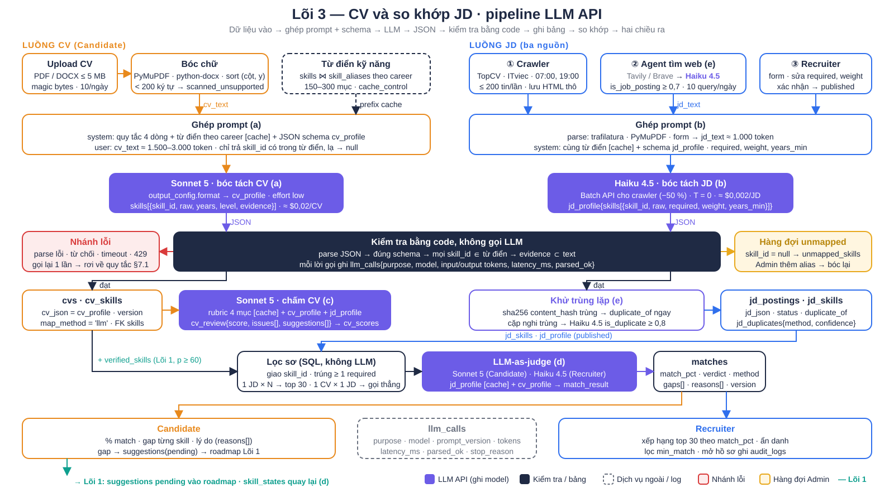
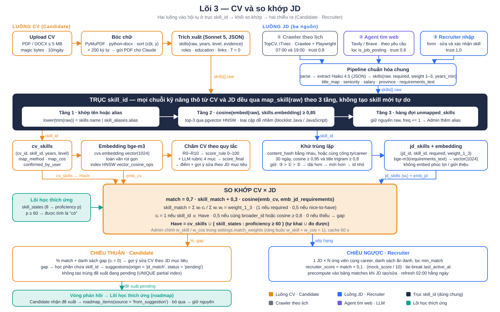

# Lõi 3 — CV và so khớp JD

Lõi 3 biến CV và tin tuyển dụng (JD) thành hai hồ sơ kỹ năng JSON trên cùng một từ điển `skill_id`, rồi đánh giá mức khớp giữa chúng. CV, JD, học phần và câu hỏi phỏng vấn đều trỏ tới bảng `skills`, nên gap từ JD khớp thẳng với học phần mà không cần bước dịch. Lõi thuộc con đường sự nghiệp của Candidate (bước 5 và 6 trong chu trình DevRoom) và là nguồn dữ liệu cho Recruiter tìm ứng viên. Đầu ra là % match, danh sách kỹ năng thiếu (gap), lý do và đề xuất học phần đẩy ngược về lõi học thích ứng. Ba engine của tài liệu kỹ thuật gộp trong lõi này: E6 (bóc tách và chấm CV), E7 (thu thập và chuẩn hoá JD), E8 (matching). Lõi triển khai bằng LLM API: Claude Sonnet 5 bóc tách CV, chấm CV và so khớp; Claude Haiku 4.5 bóc tách JD hàng loạt, lọc kết quả tìm web và phán xét trùng lặp. Các thuật toán tất định ở mục 7 là đề xuất bổ sung.

## 1. Nghiệp vụ

Hai luồng vào, một trục chung, hai chiều ra.

| # | Bước | Ai | Kết quả |
|---|---|---|---|
| 1 | Upload CV PDF/DOCX hoặc dùng CV do AI tạo | Candidate | `cvs` (raw_text, cv_json), `cv_skills` theo `skill_id` |
| 2 | Chấm CV theo JD mục tiêu | Hệ thống | `cv_review` 0–100, gợi ý sửa từng bullet, cờ ATS |
| 3 | Thu JD từ ① crawler theo lịch, ② agent tìm web theo yêu cầu, ③ Recruiter nhập | Hệ thống, Recruiter | `jd_postings` chuẩn hoá, `jd_skills` theo `skill_id`, bản trùng gắn `duplicate_of` |
| 4 | Xem feed việc làm, chọn một JD | Candidate | % match, gap từng skill, lý do |
| 5 | Tạo đề xuất cải thiện từ gap | Candidate | `suggestions(status='pending')` chờ nhận hoặc bỏ qua ở roadmap |
| 6 | Tìm ứng viên cho một JD | Recruiter | Danh sách ẩn danh xếp theo `match_pct`, lọc `min_match` |
| 7 | Admin duyệt hàng đợi `unmapped_skills`, đổi model và prompt | Admin | Alias mới, `settings.llm_models`, `prompt_version` |

## 2. Sơ đồ



Đọc từ trên xuống. Hàng đầu là hai luồng vào: CV qua upload và bóc chữ; JD từ ba nguồn, nguồn ② đã có một lời gọi Haiku 4.5 lọc `is_job_posting`. Hàng hai ghép prompt: phần cố định (quy tắc, từ điển kỹ năng theo career, JSON schema) đứng trước và được cache, phần thay đổi (cv_text, jd_text) đứng sau. Hàng ba là hai khối LLM bóc tách màu tím: Sonnet 5 cho CV, Haiku 4.5 cho JD (Batch API với crawler). Dải navy ở hàng bốn là bước kiểm tra bằng code: parse JSON, đúng schema, mọi `skill_id` thuộc từ điển, `evidence` là chuỗi con của văn bản; rẽ trái là nhánh lỗi (gọi lại một lần rồi rơi về quy tắc exact + alias), rẽ phải là hàng đợi `unmapped_skills` cho Admin. Hàng năm ghi bảng `cvs`/`cv_skills` và `jd_postings`/`jd_skills`, kèm hai tác vụ phụ: chấm CV (Sonnet 5) và khử trùng lặp JD (hash trước, Haiku 4.5 phán xét cặp nghi trùng). Hàng sáu là khối so khớp: lọc sơ bằng SQL giao `skill_id` lấy top 30, rồi LLM làm giám khảo trả `match_result`, ghi bảng `matches`. Hàng cuối là hai chiều ra: Candidate nhận % match, gap và đề xuất pending đẩy về roadmap lõi 1; Recruiter nhận bảng xếp hạng ẩn danh. Mọi lời gọi LLM đều ghi `llm_calls`.

## 3. Triển khai bằng LLM API

Quy ước chung: gọi `POST /v1/messages`, đầu ra ép bằng `output_config.format` với JSON Schema `additionalProperties: false`; phần cố định của prompt (quy tắc, từ điển, rubric, schema) đặt đầu và đánh dấu `cache_control` để lần đọc lại tính ≈ 10 % giá vào; tác vụ không cần trả lời ngay đi Batch API giảm 50 %. Đơn giá dùng để ước lượng: Sonnet 5 $2 vào / $10 ra mỗi 1M token, Haiku 4.5 $1 / $5. Số token là ước lượng: một trang CV tiếng Việt ≈ 1.500 token, một JD ≈ 1.000 token, từ điển 300 mục ≈ 4.000 token. Mọi số chi phí trong mục này là ước lượng; bảng tổng hợp ở §3.7.

### 3.1 (a) Bóc tách CV — Sonnet 5

Luồng: upload (≤ 5 MB, .pdf/.docx, kiểm magic bytes) → object storage private → PyMuPDF `page.get_text("blocks")` hoặc python-docx → `len(text) < 200` → `parse_status='scanned_unsupported'` (MVP không OCR) → gộp block theo cột, sắp theo y → ghép prompt → Sonnet 5 → kiểm tra → `cvs.cv_json`, `cv_skills`.

Từ điển kỹ năng vào prompt theo hai cách. Mặc định: `skills ⋈ skill_aliases` lọc theo `career` của Candidate, 150–300 mục, mỗi mục một dòng `skill_id | name_en | alias, alias`, đặt sau quy tắc và đánh dấu cache; cùng career thì cùng prefix. Thay thế khi từ điển vượt 300 mục hoặc career chưa rõ: tool `lookup_skill(query) → [{skill_id, name, score}]` top-5 trên tên, alias và trigram; LLM gọi tool cho từng cụm lạ, thêm 1–3 vòng và ≈ 2 s. Cả hai cách giữ một quy tắc: LLM chỉ được trả `skill_id` có trong danh sách; cụm không khớp trả `raw` với `skill_id: null`.

```text
Bạn là bộ bóc tách CV của DevRoom. Chỉ trả JSON đúng schema cv_profile.
Từ điển kỹ năng nhóm {{career}} (skill_id | tên | alias): {{skill_dictionary}}      ← 150–300 dòng, cache_control
1. skills[].skill_id chỉ được là giá trị có trong từ điển. Cụm không khớp: skill_id = null, giữ nguyên raw.
2. Không suy diễn kỹ năng CV không nêu. Mỗi skill có evidence là chuỗi con nguyên văn của CV.
3. years = số năm dùng kỹ năng nếu CV nêu, không rõ → null. level theo evidence: basic | working | advanced.
4. has_metric = true khi bullet có số liệu. ats_flags: bảng, hai cột, ảnh, icon. Thiếu email, phone, link → null.
--- user ---   CV: {{cv_text}}
```

```text
cv_profile = {full_name: string|null, headline: string|null, contact: {email, phone, links: string[]},
  years_total: number|null, page_count: integer, ats_flags: string[], education: string[],
  skills: [{skill_id: string|null, raw: string, years: number|null, level: "basic"|"working"|"advanced"|null, evidence: string}],
  experiences: [{title: string, company: string|null, from: string|null, to: string|null, bullets: [{text: string, has_metric: boolean}]}]}
```

Ví dụ rút gọn. Vào: dòng CV "Frontend Developer, 2 năm. Kỹ năng: ReactJS, Typescript, Java Script, Github Action, Figma". Ra:

```json
{"headline":"Frontend Developer","years_total":2,"skills":[
 {"skill_id":"S_react","raw":"ReactJS","years":2,"level":"working","evidence":"ReactJS"},
 {"skill_id":"S_js","raw":"Java Script","years":null,"level":"working","evidence":"Java Script"},
 {"skill_id":"S_cicd","raw":"Github Action","years":null,"level":"basic","evidence":"Github Action"},
 {"skill_id":null,"raw":"Figma","years":null,"level":null,"evidence":"Figma"}]}
```

Kiểm tra sau LLM bằng code: `skill_id ∉ từ điển` → ép về null; `evidence ∉ cv_text` → bỏ skill đó; `skill_id = null` → `unmapped_skills(raw_text, freq += 1)`. Hàng đợi chỉ còn cụm lạ thật (Figma ngoài career) vì LLM đã xử lý biến thể chính tả ("Java Script" → `S_js`) mà phương án alias cần Admin.

Token và chi phí: prefix ≈ 4.500 token (cache, đọc lại ≈ $0,0009), CV ≈ 3.000 token vào ($0,006), ra ≈ 1.200 token ($0,012) → ≈ $0,02/CV có cache, ≈ $0,03 không cache; độ trễ 5–15 s, chạy nền.

### 3.2 (b) Bóc tách JD — Haiku 4.5

Cùng quy tắc `skill_id` với (a); prompt khác ở ba dòng về `required`, `weight` và `years_min`. Parse trước bằng trafilatura (HTML), PyMuPDF (PDF) hoặc form Recruiter. Crawler (TopCV, ITviec, Celery beat 07:00 và 19:00, ≤ 200 tin/lần, lưu HTML thô trước) gom thành một Batch API; nguồn ② và ③ gọi ngay. Nguồn ③: LLM bóc, Recruiter sửa `required` và `weight_1_3` rồi xác nhận mới `published`.

```text
Bạn là bộ bóc tách tin tuyển dụng của DevRoom. Chỉ trả JSON đúng schema jd_profile.
Từ điển kỹ năng nhóm {{career}}: {{skill_dictionary}}                                  ← cache_control
1. skills[].skill_id chỉ lấy từ từ điển; không khớp → skill_id = null, giữ raw.
2. required = true khi ở mục yêu cầu bắt buộc hoặc đi với "thành thạo", "bắt buộc", "must"; còn lại false.
3. weight 3 = kỹ năng chính (trong tiêu đề hoặc nêu đầu); 2 = yêu cầu thường; 1 = ưu tiên. years_min nếu nêu.
4. requirements_text = phần yêu cầu, bỏ phúc lợi. level ∈ intern | junior | middle | senior | lead. Không rõ → null.
--- user ---   JD ({{source}}): {{jd_text}}
```

```text
jd_profile = {title: string, company: string|null, level: string|null, city: string|null, salary_min: number|null,
  salary_max: number|null, requirements_text: string,
  skills: [{skill_id: string|null, raw: string, required: boolean, weight: 1|2|3, years_min: number|null}]}
```

Ví dụ rút gọn. Vào: "Frontend Developer (React) — yêu cầu: thành thạo React, hiểu HTTP/REST; ưu tiên biết TypeScript". Ra: `{"title":"Frontend Developer (React)","skills":[{"skill_id":"S_react","raw":"React","required":true,"weight":3,"years_min":null},{"skill_id":"S_http","raw":"HTTP/REST","required":true,"weight":2,"years_min":null},{"skill_id":"S_ts","raw":"TypeScript","required":false,"weight":1,"years_min":null}]}`.

Token và chi phí: prefix ≈ 4.500 token cache ($0,00045), JD ≈ 1.000 token ($0,001), ra ≈ 400 token ($0,002) → ≈ $0,0035/JD, Batch ≈ $0,002; 400 tin/ngày ≈ $0,8/ngày. Độ trễ 2–4 s khi gọi ngay; Batch trả trong vòng 1 giờ (SLA 24 giờ).

### 3.3 (c) Chấm CV và gợi ý sửa — Sonnet 5

Đầu vào: `cv_profile`, `cv_text` (để trích nguyên văn) và `jd_profile` mục tiêu. Rubric bốn mục có anchor nằm trong phần cache.

```text
Bạn là người review CV cho vị trí {{jd.title}}. Chỉ trả JSON đúng schema cv_review. Rubric 0–5 mỗi mục:    ← cache_control
- clarity: headline rõ vai trò, thứ tự mục hợp lý, không lỗi ATS.   - concise: 1–2 trang, bullet ≤ 140 ký tự.
- impact: bullet có số liệu và kết quả. Anchor: ≥ 3 bullet có số = 4.
- fit: skill required của JD có evidence trong CV. Anchor: mỗi skill required thiếu trừ 1.
Quy tắc: issues[].quote và suggestions[].quote là chuỗi con nguyên văn của CV; rewrite chỉ viết lại đúng bullet đó,
không thêm kỹ năng, số liệu, công ty mà CV không có; missing_skills chỉ gồm skill_id của JD không có trong cv_profile.
--- user ---   cv_profile: {{cv_profile}}   jd_profile: {{jd_profile}}   CV: {{cv_text}}
```

```text
cv_review = {rubric: {clarity: 0..5, impact: 0..5, fit: 0..5, concise: 0..5}, score: 0..100,
  issues: [{rule: "clarity"|"impact"|"fit"|"concise"|"ats", quote: string, why: string}],
  suggestions: [{quote: string, rewrite: string, reason: string}], missing_skills: [{skill_id: string, how_to_show: string}]}
```

`score` do code tính lại `Σ rubric / 20 · 100`, không dùng số LLM trả. Ví dụ rút gọn, CV A với j1: `{"rubric":{"clarity":4,"impact":2,"fit":3,"concise":3},"score":60,"issues":[{"rule":"impact","quote":"Phát triển giao diện cho hệ thống quản lý","why":"không có số liệu"}],"suggestions":[{"quote":"Phát triển giao diện cho hệ thống quản lý","rewrite":"Xây 12 màn hình React cho hệ thống quản lý, giảm 30 % thời gian thao tác","reason":"thêm phạm vi và kết quả"}],"missing_skills":[{"skill_id":"S_http","how_to_show":"nêu dự án gọi REST API"}]}`. Giao diện đánh dấu phần trong `rewrite` không xuất hiện trong CV là "cần điền" để người dùng thay số thật.

Token và chi phí: prefix ≈ 1.200 token cache, vào ≈ 5.000 token ($0,010), ra ≈ 1.500 token ($0,015) → ≈ $0,025/lần, 10–20 s. Kết quả cache theo `(cv_id, jd_id, prompt_version)`.

### 3.4 (d) So khớp LLM-as-judge

Đưa `cv_profile` (thêm `verified_skills` từ `skill_states` lõi 1 có proficiency ≥ 60) và `jd_profile` cho LLM chấm.

```text
Bạn là giám khảo so khớp ứng viên với tin tuyển dụng. Chỉ trả JSON đúng schema match_result. Tiêu chí:    ← cache_control
- Chỉ dùng kỹ năng có trong cv_profile.skills hoặc verified_skills. Không suy diễn.
- Thiếu skill required nặng hơn nice-to-have. Cùng nhóm (Vue ↔ React) tính một phần. years_min lớn hơn years → kind = years.
- match_pct: 90–100 đủ mọi required và năm; 70–89 thiếu ≤ 1 required hoặc thiếu năm; 40–69 thiếu 2–3 required; < 40 còn lại.
- gaps[] chỉ chứa skill_id của JD; reasons[] mỗi dòng một skill kèm evidence nguyên văn.
--- user ---   jd_profile: {{jd_profile}}   ← đặt trước để cache khi 1 JD × 30 CV   cv_profile: {{cv_profile}}
```

```text
match_result = {match_pct: 0..100, verdict: "strong"|"partial"|"weak",
  gaps: [{skill_id: string, required: boolean, kind: "missing"|"partial"|"years"}],
  reasons: [{skill_id: string, matched: boolean, evidence: string}]}
```

Ví dụ rút gọn, CV A × j1: `{"match_pct":80,"verdict":"strong","gaps":[{"skill_id":"S_http","required":true,"kind":"missing"}],"reasons":[{"skill_id":"S_react","matched":true,"evidence":"ReactJS, 2 năm"},{"skill_id":"S_http","matched":false,"evidence":"không có trong CV"},{"skill_id":"S_ts","matched":true,"evidence":"Typescript"}]}`.

Chi phí một cặp với Sonnet 5: prefix ≈ 800 token cache, vào ≈ 1.700 token ($0,0034), ra ≈ 500 token ($0,005) → ≈ $0,009, 3–6 s. Với Haiku 4.5: ≈ $0,004.

Chiều Candidate: 1 CV × 1 JD khi mở tin, ghi `matches` theo `(cv_id, jd_id, cv_version, jd_version, prompt_version)`; chưa đổi thì không gọi lại. Chiều Recruiter, 1 JD × N ứng viên: gọi đủ N là không khả thi. N = 1.000 → $9/JD với Sonnet 5, 20 phút nếu chạy 10 luồng; N = 10.000 → $90/JD; tính lại hằng đêm cho 400 JD là $36.000/ngày. Cách giảm, dùng đồng thời:

1. Lọc sơ bằng SQL, không LLM: `cv_skills ⋈ jd_skills` theo `skill_id`, giữ ứng viên trúng ít nhất một skill required, xếp theo tổng `weight_1_3` của skill trúng, chỉ gọi LLM cho top 30 → ≈ $0,27/JD với Sonnet 5.
2. Dùng Haiku 4.5 làm giám khảo ở chiều Recruiter → ≈ $0,12/JD; Sonnet 5 chỉ dùng khi Candidate mở tin.
3. Đặt `jd_profile` trong phần cache trước `cv_profile`: 30 lời gọi cùng JD đọc lại prefix, bớt ≈ 15 %.
4. Chỉ chạy khi Recruiter bấm tìm, giữ kết quả 24 giờ; không precompute toàn bộ.

### 3.5 (e) Agent tìm JD trên web và khử trùng lặp — Haiku 4.5

Agent tìm web: khi Candidate bấm "Tìm thêm", code sinh 1–3 query từ `career + level + city`, gọi tool search (Tavily hoặc Brave, 10 kết quả/query, 10 query/ngày/người), rồi một lời gọi Haiku 4.5 lọc cả 10 kết quả; kết quả đạt được fetch bằng trafilatura và đi qua (b) với `source='web_search'`, `trust_weight=0,6`.

```text
Với mỗi kết quả tìm kiếm dưới đây, xác định có phải một tin tuyển dụng cụ thể (một vị trí, một công ty).
Không phải: trang danh sách việc, blog, khóa học, hồ sơ công ty, tin ghi rõ đã hết hạn. Chỉ trả JSON.
Kết quả: {{results[{i, url, title, snippet}]}}   → {items: [{i: integer, is_job_posting: boolean, confidence: 0..1, reason: string}]}
```

Giữ `is_job_posting ∧ confidence ≥ 0,7`. Chi phí ≈ 2.500 token vào + 300 ra → ≈ $0,004/query, 2 s.

Khử trùng lặp hai bước. Bước 1 bằng hash, không LLM: `content_hash = sha256(lower(trim(title)) || '|' || lower(trim(company)) || '|' || normalized_desc)`, `normalized_desc` bỏ HTML, hạ chữ, gộp khoảng trắng, bỏ số điện thoại, email, số; trùng hash → gắn `duplicate_of` ngay. Bước 2 cho cặp nghi trùng: cùng `company_id` hoặc cùng `career` và `province_code`, `posted_at` cách ≤ 30 ngày, `similarity(title) ≥ 0,6` (pg_trgm) hoặc giao `skill_id` ≥ 70 % → Haiku 4.5 phán xét.

```text
Hai tin tuyển dụng A và B dưới đây có phải cùng một vị trí của cùng công ty được đăng lại hay không?
Cùng công ty nhưng khác vị trí, khác cấp bậc hoặc khác thành phố → không trùng. Chỉ trả JSON.
A: {{jd_a: title, company, city, level, requirements_text}}   B: {{jd_b}}   → {is_duplicate: boolean, confidence: 0..1, reason: string}
```

`is_duplicate ∧ confidence ≥ 0,8` → giữ bản theo thứ tự nguồn ③ > ① > ②, mô tả dài hơn, `posted_at` mới hơn, `id` nhỏ hơn; bản kia `status='duplicate'`, `duplicate_of`, ghi `jd_duplicates(kept_id, dropped_id, reason, method='llm', confidence)`. Không xoá. Chi phí ≈ 2.000 token vào + 100 ra → ≈ $0,0025/cặp. Một lần tìm điển hình (1 query, 5 tin qua lọc, 3 cặp nghi trùng) ≈ $0,004 + 5 × $0,0035 + 3 × $0,0025 ≈ $0,03.

### 3.6 Xử lý lỗi và cache

| Tình huống | Xử lý |
|---|---|
| Parse thất bại hoặc sai schema (hiếm khi có `output_config.format`; gặp khi `stop_reason='max_tokens'`) | Gọi lại một lần kèm thông báo lỗi và `max_tokens` gấp đôi. Vẫn lỗi → rơi về quy tắc: (a)(b) khớp exact + alias (§7.1) với `map_method='rule_fallback'`; (c) chỉ `score_rule` (§7.2); (d) công thức §7.3 với `method='formula'`; (e) bỏ kết quả đó |
| Từ chối (`stop_reason='refusal'`) | Không gọi lại; `llm_calls.parsed_ok=false`, `parse_status='llm_refused'`, báo người dùng |
| Timeout 60 s, lỗi 5xx | SDK tự gọi lại 2 lần có backoff; vẫn lỗi → hàng đợi Celery chạy lại sau 5 phút, tối đa 3 lần |
| 429 vượt hạn mức | Giảm concurrency hàng đợi; crawler và tính lại hàng loạt chuyển hết sang Batch API |
| Vượt `llm_token_budget_per_user_day` | Tác vụ (c)(d) của người đó chuyển sang quy tắc và công thức §7 đến hết ngày |
| Đổi từ điển (alias mới), prompt hoặc model | Tăng `prompt_version`; prefix cache đổi; `matches` và `cv_scores` có version cũ coi là hết hạn |

Cache prompt: từ điển theo career (a)(b), rubric (c), tiêu chí (d) là phần cố định; `jd_profile` cache thêm ở chiều Recruiter. Mục tiêu `cache_read_input_tokens ≥ 80 %` tổng token vào ở (a)(b).

### 3.7 Tổng hợp chi phí

Giả định quy mô: 200 CV mới, 400 JD, 200 lượt chấm CV, 2.000 lượt mở JD, 50 lượt Recruiter tìm, 100 lượt tìm web mỗi ngày.

| Tác vụ | Model | Token vào (cache / mới) | Token ra | $/lần | Lượt/ngày | $/ngày |
|---|---|---|---|---|---|---|
| (a) Bóc tách CV | Sonnet 5 | 4.500 / 3.000 | 1.200 | 0,02 | 200 | 4,0 |
| (b) Bóc tách JD | Haiku 4.5, Batch | 4.500 / 1.000 | 400 | 0,002 | 400 | 0,8 |
| (c) Chấm CV | Sonnet 5 | 1.200 / 5.000 | 1.500 | 0,025 | 200 | 5,0 |
| (d) So khớp, Candidate | Sonnet 5 | 800 / 1.700 | 500 | 0,009 | 2.000 | 18,0 |
| (d) So khớp, Recruiter top 30 | Haiku 4.5 | 1.300 / 1.200 | 500 | 0,004 | 1.500 | 6,0 |
| (e) Lọc web + phán xét trùng | Haiku 4.5 | 0 / 2.500 + 2.000 | 300 + 100 | 0,03/lần tìm | 100 | 3,0 |
| Tổng | | | | | | ≈ 37 → ≈ $1.100/tháng |

So khớp chiếm gần 65 % chi phí. Đây là lý do mục 7 đề xuất công thức tất định làm lớp đầu và LLM chỉ giải thích cho các cặp người dùng thực sự mở.

## 4. Dữ liệu

Đầu vào tác vụ (d), rút gọn: `{"jd_profile":{"id":"j1","skills":[{"skill_id":"S_react","required":true,"weight":3},{"skill_id":"S_http","required":true,"weight":2},{"skill_id":"S_ts","required":false,"weight":1}]},"cv_profile":{"id":"cv_u1","skills":[{"skill_id":"S_react","years":2},{"skill_id":"S_ts"},{"skill_id":"S_css"}],"verified_skills":[{"skill_id":"S_js","proficiency":82}]}}`. Đầu ra ghi `matches`: `{"jd_id":"j1","cv_id":"cv_u1","match_pct":80,"verdict":"strong","gaps":[{"skill_id":"S_http","required":true,"kind":"missing"}],"method":"llm","prompt_version":3,"suggestions_created":1}`.

| Bảng | Cột chính |
|---|---|
| `skills` | `skill_id`, `name_en`, `name_vi`, `broader_id`, `branch`, `career_group`, `embedding` (§7) |
| `skill_aliases` | `id`, `skill_id`, `alias` (UNIQUE `lower(alias)`), `lang`, `added_by` |
| `unmapped_skills` | `id`, `raw_text`, `freq`, `context`, `best_guess_skill_id`, `status`, `resolved_by` |
| `cvs` | `id`, `candidate_id`, `source`, `file_url`, `raw_text`, `cv_json` (= `cv_profile`), `page_count`, `parse_status`, `prompt_version`, `version`, `embedding` (§7) |
| `cv_skills` | `cv_id`, `skill_id` (FK `skills`), `raw_text`, `years`, `level`, `evidence`, `map_method` (`llm` / `rule_fallback` / `alias`), `confirmed_by_user` |
| `cv_scores` | `id`, `cv_id`, `jd_id`, `score`, `rubric_json`, `review_json`, `score_rule` (§7), `prompt_version`, `run_no` |
| `jd_postings` | `id`, `source`, `trust_weight`, `url_canonical`, `content_hash`, `company_id`, `title_normalized`, `seniority`, `province_code`, `salary_min/max`, `requirements_text`, `jd_json`, `status`, `duplicate_of`, `posted_at`, `version`, `embedding` (§7) |
| `jd_skills` | `jd_id`, `skill_id` (FK `skills`), `raw_text`, `required`, `weight_1_3`, `years_min`, `map_method` |
| `jd_duplicates` | `kept_id`, `dropped_id`, `reason`, `method` (`hash` / `llm` / `cosine`), `confidence` |
| `matches` | `jd_id`, `candidate_id`, `cv_version`, `jd_version`, `match_pct`, `verdict`, `gaps`, `reasons`, `method` (`llm` / `formula`), `prompt_version`, `computed_at` |
| `suggestions` | `id`, `room_id`, `module_id`, `skill_id`, `origin`, `reason`, `priority`, `status` |
| `llm_calls` | `id`, `purpose` (`cv_extract` / `jd_extract` / `cv_review` / `match` / `web_filter` / `dedupe`), `model`, `prompt_version`, `input_tokens`, `cache_read_tokens`, `output_tokens`, `latency_ms`, `parsed_ok`, `stop_reason`, `ref_type`, `ref_id`, `created_at` |
| `settings`, `settings_history` | `k='llm_models'`, `k='prompt_version'`, `k='match_weights'` (§7) |

Bất biến: mọi dòng `cv_skills`, `jd_skills` có `skill_id` là FK hợp lệ; cụm không map nằm trong `unmapped_skills` kèm `raw_text`. Chuỗi gốc không bao giờ bị bỏ.

## 5. Tham số cấu hình

| Tên | Mặc định | Ảnh hưởng |
|---|---|---|
| `llm_model_cv_extract`, `llm_model_cv_review`, `llm_model_match_candidate` | `claude-sonnet-5` | Chất lượng bóc tách, gợi ý và lý do; đổi sang Haiku giảm ≈ 2 lần chi phí, giảm độ chính xác skill hiếm |
| `llm_model_jd_extract`, `llm_model_match_recruiter`, `llm_model_web_filter`, `llm_model_dedupe` | `claude-haiku-4-5` | Tác vụ hàng loạt; nâng lên Sonnet khi G2, G6 không đạt |
| `temperature` | 0 với Haiku 4.5; Sonnet 5 không nhận tham số lấy mẫu, dùng `output_config.effort='low'` | Ổn định giữa các lần gọi |
| `max_tokens` | 4.000 (a) · 1.500 (b) · 3.000 (c) · 1.000 (d) · 500 (e) | Thấp → cắt JSON giữa chừng, tốn một lần gọi lại |
| `llm_retry_on_parse_error`, `llm_timeout_s` | 1, 60 | Số lần gọi lại trước khi rơi về quy tắc; quá → hàng đợi chạy lại |
| `dictionary_max_in_prompt` | 300 | Vượt → dùng tool `lookup_skill` |
| `is_job_posting_min_confidence` | 0,7 | Hạ → nhiều trang không phải JD lọt vào (b) |
| `dedupe_min_confidence` | 0,8 | Hạ → gộp nhầm tin khác nhau, lỗi nặng hơn bỏ sót |
| `jd_neardup_window_days`, `jd_neardup_title_sim` | 30, 0,6 | Số cặp đưa LLM phán xét |
| `prefilter_top_k` | 30 | Số ứng viên gọi LLM mỗi JD; chi phí Recruiter tỉ lệ thuận |
| `match_cache_ttl_h` | 24 (Recruiter); theo version (Candidate) | Khi nào gọi lại |
| `llm_token_budget_per_user_day` | 200.000 | Vượt → dùng §7 |
| `web_search_queries_per_day`, `cv_upload_per_day` | 10, 10 | Hạn mức người dùng |
| `trust_weight` | 1,0 / 0,8 / 0,6 | Bản nào được giữ khi trùng |
| `p_pass_for_have`, `min_match` | 60, 50 | `skill_states` nào vào `verified_skills`; ngưỡng Recruiter lọc |
| `prompt_version` | 1 | Tăng khi đổi prompt, từ điển, model; buộc tính lại |

## 6. Kiểm chứng

| # | Đầu ra | Golden set | Chỉ số và ngưỡng |
|---|---|---|---|
| G1 | `cv_profile` | 100 CV (50 tiếng Việt, 50 tiếng Anh, 20 bản hai cột) gán nhãn tay `skill_id`, `years` | F1 theo `skill_id` ≥ 0,90; MAE `years_total` ≤ 0,5; `evidence ⊂ cv_text` 100 %; `skill_id ∉ từ điển` = 0 sau kiểm tra |
| G2 | `jd_profile` | 200 JD từ ba nguồn | F1 `skill_id` ≥ 0,90; precision `required` ≥ 0,85; MAE `weight` ≤ 0,5 |
| G3 | `cv_review` | 60 CV × 2 người chấm rubric | Spearman(`score`, trung bình người) ≥ 0,7; `quote ⊂ cv_text` 100 %; đánh giá mù "gợi ý hữu ích" ≥ 80 % |
| G4 | `match_result` | 300 cặp CV × JD gán nhãn 3 mức | kappa (`verdict`) ≥ 0,6; MAE `match_pct` ≤ 12 điểm; gap recall ≥ 0,85, precision ≥ 0,90 |
| G5 | `is_job_posting` | 200 URL | F1 ≥ 0,90 ở ngưỡng 0,7 |
| G6 | `is_duplicate` | 150 cặp (75 trùng thật) | precision ≥ 0,95, recall ≥ 0,85 |
| C1 | Hợp đồng JSON | Mọi lời gọi trong G1–G6 | 100 % parse đúng schema hoặc rơi về quy tắc; FK `skill_id` không vi phạm |
| C2 | Test-retest | Chạy G1 và G4 ba lần | `match_pct` lệch ≤ 5 ở ≥ 95 % cặp; Jaccard(`skills`) ≥ 0,9 |
| C3 | Đơn điệu | Thêm 1 skill required vào CV trong G4 | `match_pct` không giảm ở ≥ 95 % cặp (LLM không bảo đảm tuyệt đối; §7.3 bảo đảm) |
| C4 | Đề xuất | Bấm "Tạo đề xuất" hai lần cho cùng cặp | Lần 2 tạo 0, lý do "đang pending" |
| C5 | Chi phí | `llm_calls` một ngày | Tổng ≤ ngân sách; `cache_read_tokens ≥ 80 %` token vào ở (a)(b) |

## 7. Đề xuất thuật toán bổ sung

Các thuật toán dưới đây không gọi API, cho kết quả cố định và giải thích được từng điểm. Chúng là đường rơi về khi LLM lỗi (§3.6) và là phương án thay thế khi cần giảm chi phí hoặc bảo đảm đơn điệu.

| Thuật toán | Thay hoặc bổ sung bước LLM nào | Lợi ích | Điều kiện áp dụng |
|---|---|---|---|
| 7.1 Chuẩn hoá ba tầng exact → alias → cosine | Thay bước gán `skill_id` trong (a)(b); đường rơi về của cả hai | Không tốn token, < 5 ms/cụm, kết quả cố định, giải thích bằng `map_method` | Bảng alias ≥ 2.000 dòng, blocklist từ golden set, Admin xử lý hàng đợi |
| 7.2 Chấm CV theo quy tắc R0–R10 | Bổ sung (c): `score_final = 0,5·score_rule + 0,5·score_llm` | Ổn định giữa các lần, đo được, không bịa | Chấp nhận đo hình thức, không đo năng lực |
| 7.3 Công thức `0,7·skill_match + 0,3·cosine` | Thay (d) ở chiều Recruiter và ở lọc sơ; LLM chỉ giải thích cho top | $0, SQL 50 ms với N = 10.000, đơn điệu, đổi trọng số một dòng `settings` | Có embedding bge-m3 cho CV và JD, có `skill_states` |
| 7.4 Khử trùng lặp hash + cosine + trigram | Thay phán xét LLM trong (e) | Chạy trong một câu SQL, không gọi API | Có embedding JD; chấp nhận bỏ sót tin viết lại nhiều |
| 7.5 `recruiter_score` và ánh xạ gap → học phần | Đã tất định, không có bước LLM tương ứng | Chặn trùng pending bằng index | `module_skills` phủ đủ skill |



### 7.1 Chuẩn hoá về `skill_id` ba tầng

Tầng 1 `lower(trim(raw))` bằng `skills.name_en | name_vi` → `map_method='exact'`, `map_cos=1`; tầng 2 bằng `skill_aliases.alias` (UNIQUE `lower(alias)`) → `'alias'`; tầng 3 `cosine(embed(raw), skills.embedding) ≥ 0,85` trên top-3 HNSW và cặp (top-1, top-2) không thuộc `skill_confusion_blocklist` → `'cosine'`, `map_cos`; không đạt → `unmapped_skills(raw_text, freq += 1, best_guess, best_cos)`.

```python
def map_skill(raw):
    k = norm(raw)
    if hit := exact_lookup(k):  return hit, "exact", 1.0
    if hit := alias_lookup(k):  return hit, "alias", 1.0
    rows = knn_skills(embed(raw), k=3)          # 1 - (a <=> b) trong pgvector
    if rows and rows[0].cos >= CFG.cos_threshold and (rows[0].skill_id, rows[1].skill_id) not in BLOCKLIST:
        return rows[0].skill_id, "cosine", rows[0].cos
    enqueue_unmapped(raw)                        # giữ raw, không tạo skill mới
    return None, "unmapped", rows[0].cos if rows else 0.0
```

Ngưỡng 0,85 chọn từ golden set 300 chuỗi quét 0,75 → 0,95: precision ≥ 0,95, top-1 accuracy ≥ 0,90, `unmapped_rate < 10 %`. Cặp gần nghĩa (React / React Native, Java / JavaScript) bắt buộc vào blocklist.

### 7.2 Chấm CV theo quy tắc

R0 điểm nền +40 · R1 có `full_name` và `headline` +10 · R2 mỗi bullet kinh nghiệm có số liệu +6, cap +18 · R3 bullet dài > 140 ký tự −5/bullet · R4 ≥ 3 bullet kinh nghiệm/dự án +8 · R5 link GitHub hợp lệ +8 · R6 liệt kê ≥ 4 skill cụ thể +6 · R7 mỗi skill của JD mục tiêu thiếu trong `cv_skills` −4/skill · R8 `page_count ∈ {1, 2}` +5, ngoài dải −5 · R9 không có `ats_flags` +4 · R10 có email và phone +3.

`score_rule = clamp(round(ΣR), 0, 100)`. Kết hợp với (c): `score_final = 0,5·score_rule + 0,5·score_llm`, `score_llm = Σ rubric / 20 · 100`. Ví dụ CV A với j1: R7 trừ 12 (thiếu JavaScript, HTTP/REST, Git), R3 trừ 5 → `score_rule = 73`.

### 7.3 Công thức so khớp

```text
match       = w_skill · skill_match + w_cos · cosine(emb_cv, emb_jd_requirements)     (0,7 / 0,3)
skill_match = Σᵢ wᵢ·cᵢ / Σᵢ wᵢ                        i chạy qua mọi skill của JD
wᵢ          = weight_1_3(i) · (1,0 nếu required, 0,5 nếu nice_to_have)
Have        = {skill_id ∈ cv_skills} ∪ {skill_id ∈ skill_states : proficiency ≥ 60}
cᵢ          = 1 nếu skill_id(i) ∈ Have; 0,5 nếu có j ∈ Have cùng broader_id hoặc cosine(emb_i, emb_j) ≥ 0,8; 0 còn lại → gap
```

```sql
-- pgvector: <=> là cosine distance, cosine_sim = 1 - (a <=> b); index HNSW vector_cosine_ops
WITH cfg AS (SELECT (v->>'w_skill')::float ws, (v->>'w_cos')::float wc FROM settings WHERE k='match_weights'),
have AS (SELECT skill_id FROM cv_skills WHERE cv_id = $1
         UNION SELECT skill_id FROM skill_states WHERE room_id = $2 AND p >= 60),
sm AS (SELECT js.jd_id,
         SUM(js.weight_1_3 * (CASE WHEN js.required THEN 1.0 ELSE 0.5 END) *
             CASE WHEN js.skill_id IN (SELECT skill_id FROM have) THEN 1.0
                  WHEN EXISTS (SELECT 1 FROM have h JOIN skills a ON a.skill_id = js.skill_id
                               JOIN skills b ON b.skill_id = h.skill_id
                               WHERE a.broader_id = b.broader_id
                                  OR 1 - (a.embedding <=> b.embedding) >= 0.8) THEN 0.5
                  ELSE 0.0 END)
         / NULLIF(SUM(js.weight_1_3 * (CASE WHEN js.required THEN 1.0 ELSE 0.5 END)), 0) AS skill_match
       FROM jd_skills js GROUP BY js.jd_id)
SELECT j.id, ROUND((cfg.ws * sm.skill_match + cfg.wc * (1 - (c.embedding <=> j.embedding)))::numeric, 4) AS match
FROM jd_postings j JOIN sm ON sm.jd_id = j.id JOIN cvs c ON c.id = $1 CROSS JOIN cfg
WHERE j.status = 'active' ORDER BY match DESC LIMIT 50;
```

Ví dụ CV A × j1: `skill_match = 8,5/10,5 = 0,810`, `cos = 0,830`, `match = 0,7·0,810 + 0,3·0,830 = 0,816` → 82 %, gap = HTTP/REST. Chỉ embed phần yêu cầu của JD, không embed phúc lợi. Thêm một skill vào Have thì match không bao giờ giảm (đơn điệu), điều LLM-as-judge chỉ đạt xấp xỉ (C3). Công thức tuyến tính được chọn thay LightGBM vì chưa có nhãn "được mời/được tuyển" và vì giải thích được từng skill mất bao nhiêu điểm.

### 7.4 Khử trùng lặp bằng hash và cosine

1. Trùng `content_hash` (§3.5) → cùng tin, không cần bước nào khác.
2. Gần đúng: cùng `company` hoặc cùng `career`, cách nhau ≤ 30 ngày, `cosine(embedding) ≥ 0,95` và `similarity(title) ≥ 0,8` (pg_trgm) → trùng, `jd_duplicates.method='cosine'`.
3. Chọn bản giữ và ghi bảng như §3.5. Ví dụ j1 và j2 cùng công ty khác 1 từ: cos 0,968, title 0,833 → j2 `duplicate_of = j1`.

### 7.5 Chiều ngược và đề xuất từ gap

`recruiter_score = match_score + 0,1 · (mock_score / 10)` với mock cùng career, tie-break `last_active_at`; precompute vào `matches` khi JD tạo hoặc sửa (`UPSERT ON CONFLICT (jd_id, candidate_id)`), refresh 02:00 hằng ngày. Sinh đề xuất dùng chung cho cả hai phương án: với mỗi gap `kind='missing'` lấy học phần đầu tiên có `module_skills.skill_id = s`; bỏ qua nếu học phần đã trong `roadmap_items` hoặc đã có đề xuất pending (UNIQUE partial index); còn lại `insert_suggestion(room, module, origin='jd_match', priority=w[s], status='pending', reason="Match {jd.title} ({pct}%): thiếu {s.name}")`. Candidate nhận → `roadmap_items(source='from_suggestion', position=0)`; bỏ qua → không đổi.

## 8. Demo

Chạy [demo.html](demo.html). Demo minh họa các thuật toán đề xuất ở mục 7, chạy hoàn toàn trong trình duyệt, không cần khóa API; một file, không backend, trạng thái lưu trong `localStorage`, nút Reset seed lại. Bản LLM API (mục 3) cần backend giữ khóa nên không đưa vào demo tĩnh.

| Thao tác | Quan sát được |
|---|---|
| Mục 1: kéo ngưỡng tầng 3 xuống 0,70 | "Terraform" và "Prometheus" bị map sai (false positive); kéo lên 0,99 thì "Github Action", "Dockerr" rơi vào unmapped |
| Mục 1: gán alias cho cụm trong hàng đợi | Ba CV được trích xuất lại, hàng đợi giảm, nhật ký ghi alias mới |
| Mục 2: chọn CV A/B/C, sửa văn bản, bấm Trích xuất | Bảng cụm từ → tầng khớp → `skill_id`; top-3 và điểm JW cho cụm unmapped; years bắt bằng regex kèm ngữ cảnh |
| Mục 3: đổi JD mục tiêu | R7 đổi theo skill thiếu, tổng điểm và gợi ý đổi ngay |
| Mục 4: bấm "Chạy pipeline chuẩn hóa" rồi "Chạy khử trùng lặp" | Hash rút gọn, 8 cặp cosine cao nhất, cặp bị coi là trùng, bản được giữ và lý do |
| Mục 5: chọn CV và JD, kéo trọng số | Bảng wᵢ, cᵢ, lý do từng skill; hai vector số; cosine tính ra; % đổi theo trọng số |
| Mục 6: đổi JD | 10 ứng viên xếp lại theo `recruiter_score`, cột mock và Verified |
| Mục 7: bấm "Tạo đề xuất từ gap" | Đề xuất pending theo học phần, lần bấm sau không tạo trùng |
| Mục 8 | Nhật ký từng bước với số |

| Phần | Thật hay mô phỏng |
|---|---|
| Tầng 1, 2 (tên, alias), blocklist, hàng đợi unmapped | Logic thật của §7.1 |
| Tầng 3 | Mô phỏng bằng Jaro–Winkler ngưỡng 0,85; §7.1 dùng cosine bge-m3 qua pgvector |
| Trích xuất cụm từ, years, headline | Mô phỏng bằng regex `(\d+)\s*\+?\s*(năm|years?)` và quét n-gram; phương án LLM API là §3.1 |
| Bộ quy tắc R0–R10 | Logic thật của §7.2; `page_count` ước từ độ dài, `ats_flags` chỉ kiểm ký tự tab |
| `score_llm`, gợi ý sửa, LLM-as-judge, lọc web, phán xét trùng (§3) | Không có trong demo |
| `content_hash`, quy tắc giữ bản, cửa sổ 30 ngày, title trigram | Logic thật của §7.4; hash cyrb53 thay sha256; cosine bag-of-words thay embedding |
| Công thức match, wᵢ, cᵢ, Have, trọng số Admin | Logic thật của §7.3; cosine dùng vector bag-of-skills (`v[s] = p/100`, tối thiểu 0,6 nếu có trong CV) |
| Chiều ngược, `recruiter_score`, sinh đề xuất, chặn trùng pending | Logic thật của §7.5 trên 10 ứng viên và roadmap seed cố định |

## 9. Hạn chế

| Phương án | Hạn chế | Hệ quả |
|---|---|---|
| LLM API | Kết quả lệch giữa các lần gọi dù cùng đầu vào | `match_pct` cùng cặp có thể chênh vài điểm; cần schema, effort thấp, cache theo version và test-retest C2 |
| LLM API | Chi phí theo token, so khớp 1 JD × N tốn N lời gọi | Bắt buộc lọc sơ top 30 và Haiku ở chiều Recruiter; so khớp vẫn chiếm ≈ 65 % chi phí |
| LLM API | Độ trễ 2–15 s mỗi lời gọi | Bóc tách và chấm chạy nền; mở JD phải có trạng thái chờ hoặc dùng công thức §7.3 hiển thị trước |
| LLM API | Bịa: skill không có trong CV, số liệu trong `rewrite`, `skill_id` ngoài từ điển | Kiểm tra `evidence ⊂ text`, FK từ điển, đánh dấu phần cần điền; vẫn cần người dùng xác nhận |
| LLM API | Khó giải thích vì sao ra đúng số điểm đó; không bảo đảm đơn điệu | `reasons[]` chỉ là diễn giải; Recruiter cần ngưỡng `min_match` có lề |
| LLM API | Từ chối, parse lỗi, hạn mức | Có nhánh rơi về quy tắc nên chất lượng không đồng đều giữa hai đường |
| Thuật toán đề xuất | Điểm rule đo hình thức; R7 khuyến khích nhồi keyword | Không đo năng lực; cần giới hạn `cv_missing_skill_penalty` |
| Thuật toán đề xuất | Cosine tầng 3 nhầm cặp gần nghĩa; biến thể chính tả phải qua Admin | Blocklist bắt buộc; hàng đợi unmapped lớn hơn phương án LLM |
| Thuật toán đề xuất | `cᵢ = 1` không phân biệt biết sơ và 3 năm; trọng số 0,7/0,3 chọn tay | `years_min` chưa vào công thức; nhãn đầu tiên là tỉ lệ candidate `match ≥ 0,7` được mời |
| Cả hai | CV nhiều cột, chữ trong ảnh; weight skill JD nguồn ①② do LLM gán | Bóc chữ sai thứ tự, MVP không OCR; nguồn ③ có Recruiter xác nhận nên đáng tin hơn |
